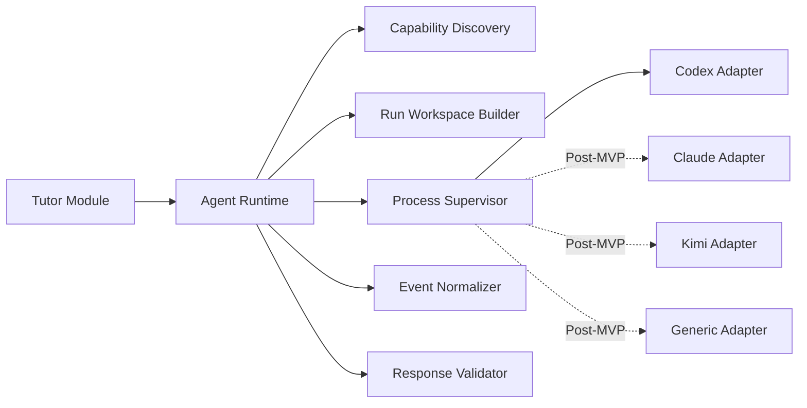

# ReplayTutor 原生 Coding Agent 绑定规范

状态：Implemented for MVP 1A
更新时间：2026-07-30

## 1. 目标

MVP 的 AI Tutor 只实现 Codex CLI。当前产品、健康检查、设置页和运行时均不发现或调用其他 Agent。同时必须保持：

- 相同的 Tutor 输入/输出契约。
- Codex 可发现、可取消、可按 run ID 恢复。
- 不暴露完整交易数据库和券商凭据。
- Agent 失败不会影响回放、撮合与确定性分析。

“原生绑定”指应用直接管理本机 Agent 进程和会话，而不是只把模型名称映射到另一个聊天 API。

## 2. 本机能力基线

2026-07-30 当前机器验收结果：

| Agent | 状态 | 已验证能力 |
|---|---|---|
| Codex CLI `0.139.0` | 已安装 | `codex exec`、JSONL 事件、JSON Schema 输出、工作目录、sandbox、临时会话 |

版本只作为当前验证证据，运行时必须动态探测，不能写死为最低版本承诺。

隔离 Spike 的实测结论：Codex `--sandbox read-only --cd <workspace>` 仍不能作为“仅工作区可读”的强隔离边界。因此运行时只写入物理裁剪的证据包，使用独立临时 `CODEX_HOME`、忽略用户配置与项目规则、禁用审批和工具写入；工作目录不含数据库、券商凭据或主目录链接。复现脚本与完整决策见 `scripts/agent-isolation-probe.py` 和 `docs/decisions/0002-agent-isolation-spike.md`。

## 3. 模块结构



外部接口只有：

```python
discover() -> list[AgentCapability]
run(spec: AgentRunSpec) -> AgentRunHandle
cancel(run_id) -> None
```

Adapter 内部负责命令差异、事件解析、会话 ID 和错误映射。

## 4. 能力发现

启动应用和用户点击“重新检测”时执行：

1. 使用 `PATH` 查找可执行文件。
2. 运行无副作用的版本/帮助命令。
3. 检查认证状态时不得打印或读取明文 token。
4. 对照版本能力表生成 `AgentCapability`。
5. 做一次不含交易数据的最小结构化响应自检。

```json
{
  "agent_id": "codex-local",
  "kind": "codex_cli",
  "executable": "/absolute/path/codex",
  "version": "0.139.0",
  "available": true,
  "authenticated": true,
  "capabilities": {
    "streaming": true,
    "structured_output": true,
    "resume": true,
    "images": true,
    "mcp": true,
    "read_only_sandbox": true
  }
}
```

认证未知与未认证必须分开；检测失败时显示具体命令、退出码和修复建议。

## 5. 统一运行契约

### 5.1 AgentRunSpec

```json
{
  "run_id": "run_...",
  "agent_id": "codex-local",
  "mode": "replay_tutor",
  "thread_id": "thread_...",
  "workspace_path": "/.../runs/run_...",
  "context_file": "tutor_context.json",
  "instruction_file": "TUTOR_INSTRUCTIONS.md",
  "output_schema_file": "tutor_response.schema.json",
  "timeout_seconds": 180,
  "permissions": {
    "filesystem": "run_workspace_read_only",
    "model_service_egress": true,
    "tool_network": false,
    "tools": "none_or_workspace_read_only"
  }
}
```

### 5.2 TutorContext

上下文传文件，不把大段行情拼进命令行参数：

```json
{
  "schema_version": "1.0",
  "perspective": "in_replay",
  "visible_at": "2026-01-05T02:31:00Z",
  "instrument": {},
  "market_rules": {},
  "visible_bars": [],
  "indicators": {},
  "account_state": {},
  "orders": [],
  "executions": [],
  "playbook": {},
  "user_notes": [],
  "deterministic_facts": {},
  "question": "这次入场是否符合我的计划？"
}
```

`perspective=in_replay` 时，构造器必须物理删除未来 K 线、最终盈亏、MFE/MAE 和后续成交，而不是只写一句“请不要看”。

### 5.3 TutorResponse

Tutor 生成的图上标注只能写入独立 AI 图层，初始状态为 `proposed`。用户接受、
拒绝或修改时由应用追加处置事件；Agent 不得覆盖原始标注、转换为用户图层，
也不得直接删除审计记录。

```json
{
  "summary": "",
  "observations": [
    {
      "text": "",
      "evidence_ids": ["bar_...", "execution_..."]
    }
  ],
  "inferences": [
    {
      "text": "",
      "confidence": "low|medium|high",
      "evidence_ids": []
    }
  ],
  "risks_and_unknowns": [],
  "rule_checks": [
    {
      "rule_id": "",
      "status": "passed|failed|unknown",
      "reason": "",
      "evidence_ids": []
    }
  ],
  "next_questions": [],
  "disclaimer": ""
}
```

响应进入 UI 前必须通过 JSON Schema，并验证每个 `evidence_id` 存在于本次证据包。无效引用删除并记录质量告警。

## 6. 运行工作目录

每次运行创建独立目录：

```text
runtime/agent-runs/{run_id}/
  TUTOR_INSTRUCTIONS.md
  tutor_context.json
  evidence/
    bars.parquet
    chart.png              # 可选
  tutor_response.schema.json
  events.jsonl
  result.json
  stderr.log
  manifest.json
```

`manifest.json` 记录输入文件 hash、上下文裁剪时间、Agent 版本、命令模板版本和权限。目录中不得出现券商 token、数据库文件或用户主目录软链接。

## 7. Codex Adapter

已验证的非交互入口是 `codex exec`。建议命令模板：

```text
codex exec
  --json
  --output-schema tutor_response.schema.json
  --sandbox read-only
  --ask-for-approval never
  --ephemeral
  --cd <run_workspace>
  -
```

实现要求：

- Prompt 从 stdin 传入，命令行只传固定参数和经过验证的绝对路径。
- 解析 stdout JSONL 为统一事件：`run_started`、`text_delta`、`tool_event`、`result`、`run_failed`。
- 使用 `--output-schema` 约束最终响应。
- 默认 `--ephemeral`；用户启用连续 Tutor 后才保存 Codex session 映射。
- 不使用 `--dangerously-bypass-approvals-and-sandbox`。
- Agent 工作根目录只能是本次运行目录，不能直接指向交易数据库或用户知识库。

连续会话可通过 Adapter 内部保存原生 session ID，并使用 Codex 的 resume 能力；若版本不支持可靠恢复，则退化为“摘要 + 最近对话”重新构造上下文。

## 8. Claude Code Adapter（Post-MVP 预留，不实施）

已验证入口支持 `--print`、`--output-format stream-json` 和 `--json-schema`。建议模板：

```text
claude
  --print
  --output-format stream-json
  --json-schema <schema-json>
  --permission-mode plan
  --no-session-persistence
  <prompt>
```

实现要求：

- 首选从 stdin 或受控文件加载 prompt；若当前版本只能使用参数，必须进行长度限制并直接调用进程而非 shell。
- 默认 `plan`/无写权限模式；不要使用 `--dangerously-skip-permissions`。
- 解析 stream-json 并映射到统一事件。
- 若启用连续会话，保存 Claude session ID；否则使用 `--no-session-persistence`。
- 用户明确选择 MCP 扩展时，应用生成一次性 `--mcp-config`，只暴露只读市场证据工具。

## 9. Kimi Adapter（Post-MVP 预留，不实施）

当前本机没有检测到 `kimi` 命令，因此 MVP 不假设具体 flags。Adapter 分两层：

1. **内置能力描述**：版本达到已验证范围后使用正式模板。
2. **用户配置模板**：指定 executable、args、input mode、output mode、resume 参数和 JSON 提取方式。

接入验收条件：

- 非交互执行。
- 可从 stdin 或文件读取任务。
- 能返回可解析的最终文本；若无原生 JSON Schema，由 Adapter 执行提取和二次校验。
- 支持安全取消和超时。
- 不依赖 shell 字符串拼接。

若 Kimi 不支持结构化流式输出，UI 可以退化为“运行中 + 最终结果”，但不能降低 TutorResponse 校验要求。

## 10. 通用 CLI Adapter

配置示例：

```yaml
id: local-agent
executable: /absolute/path/agent
args:
  - --non-interactive
  - --input
  - "{context_file}"
stdin: "{instruction_text}"
output:
  mode: json
  result_json_path: "$"
timeout_seconds: 180
```

占位符只能来自白名单，最终通过参数数组启动。禁止 `sh -c`、反引号、`$()` 和未验证环境变量展开。

## 11. 会话模型

应用线程与原生 Agent 会话分开：

```text
tutor_thread
  ├── message 1
  ├── agent_run A → codex_session_id
  ├── message 2
  └── agent_run B → claude_session_id
```

用户切换 Agent 时，应用线程不丢失。新 Agent 获得：线程摘要、最近消息、Playbook、当前证据包；不会伪造另一个 Agent 的原生 session。

线程摘要必须标记哪些是用户原话、确定性事实、旧 Agent 推断，防止推断逐轮变成“事实”。

## 12. 提示与技能包

Tutor 指令由版本化模板组成：

```text
base_tutor
  + perspective_guard
  + market_rule_pack
  + playbook_rule_pack
  + output_contract
```

市场规则和用户 Playbook 以结构化数据提供，不靠模型记忆。模板升级后记录版本；旧报告仍能重现当时使用的指令。

为支持 Coding Agent 原生扩展，项目后续可以提供：

- 项目级 `AGENTS.md` / `CLAUDE.md`，说明 Tutor 证据纪律。
- 只读 MCP server：查询当前回放帧、订单、指标和规则。
- Agent skill：生成单笔复盘、周期总结、训练计划。

MVP 优先文件证据包；MCP 放在第二阶段，避免一开始把运行链路复杂化。

## 13. 错误与降级

统一错误类型：

| 错误 | UI 行为 |
|---|---|
| `not_installed` | 展示安装入口，不阻塞其他 Agent |
| `not_authenticated` | 展示原生登录命令 |
| `unsupported_version` | 展示最低能力与重新检测 |
| `timeout` | 可重试，保留输入包 |
| `permission_denied` | 显示受限资源，不自动放宽权限 |
| `invalid_output` | 展示原始文本预览，标记未通过结构化校验 |
| `context_too_large` | 自动缩短行情窗口并生成摘要，记录裁剪 |
| `process_crashed` | 保存 stderr、退出码和修复建议 |

任何 Agent 故障都不能修改订单、成交、账本或分析事实。

## 14. 安全基线

- 默认不提供工具；必须读取证据文件的 Adapter 只能启用运行目录内只读工具，Agent 工具不得访问任意外部网络。
- 明确区分模型服务出口与工具网络：Codex/Claude CLI 可以连接其认证和推理服务，但模型发起的工具、MCP 与用户代码默认无网络。
- 若某 CLI 无法技术上区分两类网络，MVP 使用其官方只读/无工具模式，并在能力探测结果中标记隔离等级；不得虚假显示“完全断网”。
- 能力探测必须区分 `prompt_only`、`workspace_read_only`、`host_read_only`。`host_read_only` 不能作为默认 Tutor，除非用户看见风险并显式启用。
- Agent 只看到运行目录和经过裁剪的数据。
- 不继承整个父进程环境；使用环境变量白名单。
- secret 永不进入 prompt、events 或 stderr 展示。
- 进程有 CPU/内存/时间限制和取消信号升级机制。
- 输出按不可信内容处理：转义 HTML，不执行代码、不自动调用工具。
- AI Tutor 只提供教育与复盘，不自动提交订单。

## 15. Adapter 契约测试

每个 Agent Adapter 必须通过同一套测试：

1. 未安装、未登录、版本不支持能够正确识别。
2. 最小 prompt 能返回合法 `TutorResponse`。
3. 流事件顺序稳定，stderr 不混入业务输出。
4. 超时与用户取消能终止整个进程组。
5. 上下文中放置“未来 K 线诱饵”时，`in_replay` 构造器确保文件里不存在诱饵。
6. 无效 evidence ID 被校验器拒绝。
7. Agent 尝试读取父目录时被权限阻止。
8. 切换 Agent 后应用线程连续，但原生 session 不串线。

## 16. MVP 实现顺序

1. 定义 `TutorContext`、`TutorResponse` 和 JSON Schema。
2. 实现运行工作目录与权限基线。
3. 实现 Capability Discovery。
4. 实现 Codex Adapter，并随第一条确定性回放纵向切片交付。
5. 实现事件标准化、取消、超时和审计。
6. 接入右侧 Tutor 面板。
7. MVP 到此停止扩展 Agent；只对 Codex Adapter 做版本漂移和失败矩阵硬化。
8. Claude、Kimi 和通用 Adapter 进入 Post-MVP Backlog，重新立项时再验证实际 CLI 能力。
9. 第二阶段增加只读 MCP 与连续会话。
