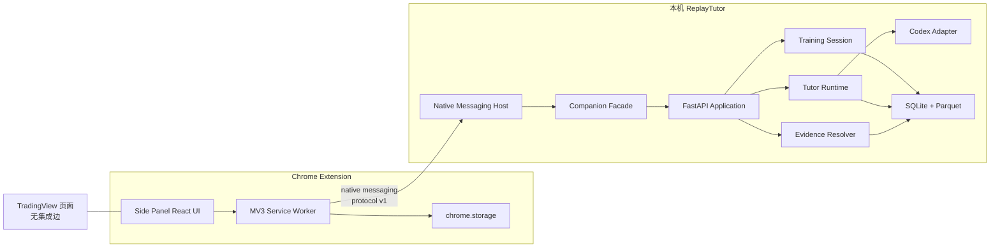
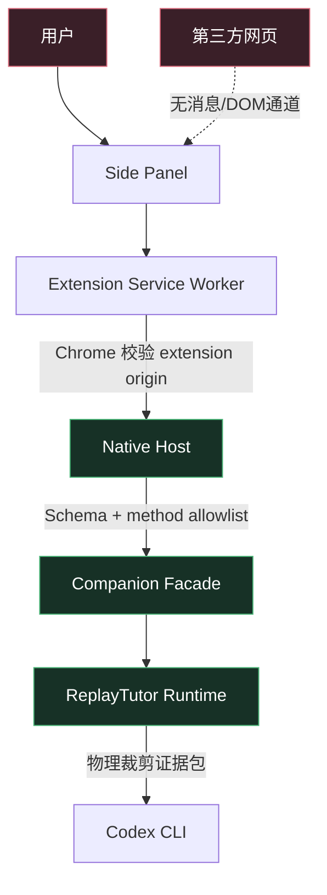
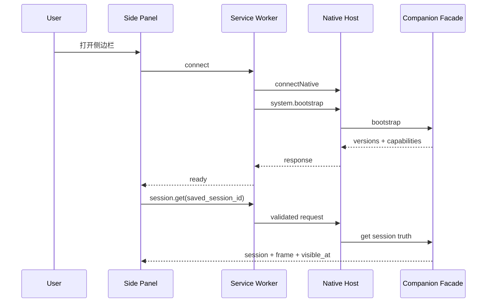
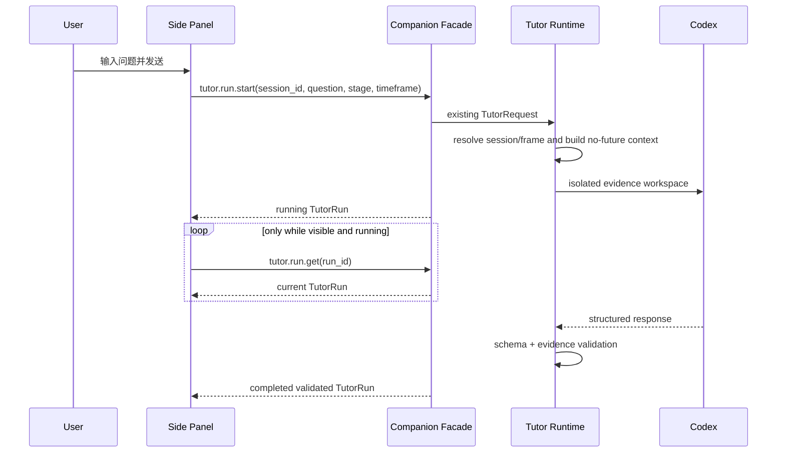
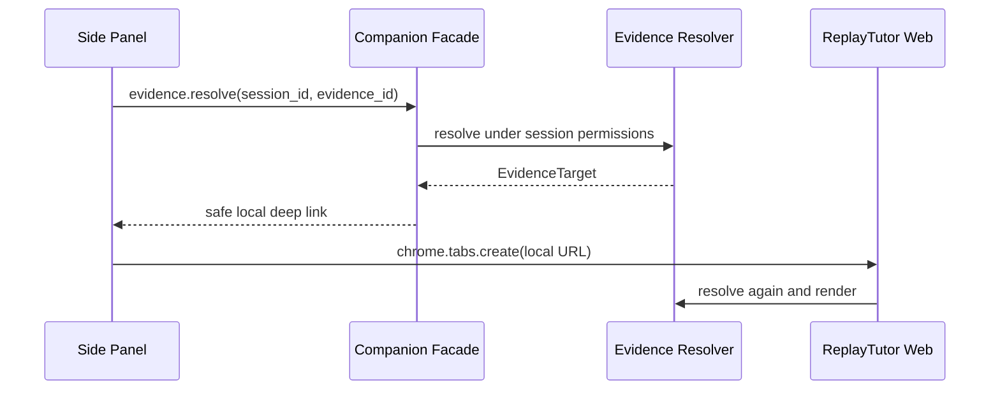

# ReplayTutor Chrome Companion 正式架构

状态：Proposed v0.1
更新时间：2026-08-03
产品需求：[Chrome Companion PRD](chrome-companion-prd.md)
上游真源：[系统架构](SYSTEM_ARCHITECTURE.md) · [Agent 绑定](AGENT_BINDING.md) · [设计系统](../DESIGN.md)

实施进度（2026-08-03）：协议模型、方法参数 Schema、裁剪 Session/Health/Agent 结果、
`POST /api/v1/companion` Facade 和 `packages/tutor-ui` 的 `TutorClient` 已落地。当前仍未添加
Chrome manifest、TradingView host permission、content script 或 Native Host。

## 1. 架构结论

Chrome Companion 是 ReplayTutor 的可选 UI Adapter，不是新的业务核心。它通过受限的本地
Connector 使用现有 Session、Tutor、Evidence 和 Agent Runtime；不直接查询数据库、行情文件，
不启动 Codex，不计算指标，也不读取 TradingView 页面。

发布架构选择：

```text
Chrome Side Panel
  → Extension Service Worker
  → Chrome Native Messaging
  → ReplayTutor Companion Connector
  → allowlisted application facade
  → existing ReplayTutor modules
```

开发阶段允许使用独立构建的 direct loopback HTTP transport，但它不是发布架构，也不得进入
Chrome Web Store manifest。

## 2. 不变量

| ID | 不变量 | 门禁 |
|---|---|---|
| CMP-INV-01 | 插件不得读取、采集或推断 TradingView 页面内容 | 无 content script/host permission；构建扫描 |
| CMP-INV-02 | 所有市场事实来自 ReplayTutor 服务端签发的 Session frame | 请求不接受客户端 `visible_at` |
| CMP-INV-03 | 插件和 Connector 不计算撮合、费用、盈亏、指标或规则 | 方法白名单与模块边界测试 |
| CMP-INV-04 | 插件不能修改订单、成交、账本、行情或用户图层 | Companion facade 无对应 command |
| CMP-INV-05 | Codex 只由现有 Tutor Runtime 以裁剪证据包启动 | Adapter 契约与隔离测试 |
| CMP-INV-06 | 正式回答必须通过 Schema 和 evidence 白名单 | 服务端响应校验 |
| CMP-INV-07 | 扩展失效、卸载或更新不影响 ReplayTutor 核心数据 | 可选 Adapter、零业务迁移 |
| CMP-INV-08 | 协议未知、版本不兼容或来源不可信时 fail closed | 握手与负向测试 |
| CMP-INV-09 | 发布包不含远程托管可执行代码 | MV3 构建扫描 |
| CMP-INV-10 | 页面不能向扩展或本地 Agent 注入指令 | 无页面消息桥、无 externally_connectable |

## 3. 方案比较

### 3.1 方案 A：扩展直接调用现有 REST

改动最小，但需要允许 extension origin 访问整个 FastAPI 路由表。仅靠 CORS 不是本地授权；
还需要配对 token、Origin 校验、能力限制和密钥轮换。适合 unpacked 技术验证，不适合发布。

### 3.2 方案 B：受限 Native Connector

扩展通过固定 native host 与本地应用通信。Connector 只接受结构化方法白名单，再调用内部
application facade。它不暴露任意 URL、HTTP method、文件或 shell 能力。安装复杂度高于方案 A，
但攻击面、权限说明和版本协商更清晰。

选择方案 B 作为发布架构。

### 3.3 方案 C：TradingView content script

该方案可读取页面，但引入第三方条款、页面结构漂移、敏感页面权限、提示注入和无未来数据
证明困难。它与 ReplayTutor 的确定性和证据真源冲突，不进入当前架构。

## 4. 总体结构



`TV --- SP` 只表示同屏，不是数据流。

## 5. 信任边界



边界规则：

- 第三方网页完全不可信，且当前版本没有进入扩展的通道。
- Side Panel 输入属于用户输入，不能成为 shell、文件路径或任意路由。
- Native Host 只信任 Chrome 传入且与 manifest `allowed_origins` 匹配的扩展 origin。
- Companion Facade 对 native host 仍执行协议、方法和参数校验。
- Tutor Runtime 不信任问题文本，只给 Codex 物理裁剪的证据包和固定运行参数。

## 6. 组件职责

### 6.1 `apps/chrome-extension`

独立 MV3 应用，职责只有：

- Side Panel 布局与交互。
- 保存非敏感 UI 偏好和最近 `session_id`/`thread_id`。
- 通过 transport interface 发送白名单命令。
- 使用生成契约校验响应。
- 打开 ReplayTutor 证据深链接。

不得包含：

- KLineChart 或 Replay Engine。
- SQLite、DuckDB 或 Parquet 客户端。
- Codex CLI 调用、命令构造或 token。
- TradingView content script、DOM selector 或网络拦截。

### 6.2 Extension Service Worker

职责：

- 响应 action 点击并打开 Side Panel。
- 建立和重建 Native Messaging port。
- 将 Side Panel request ID 映射到 native response。
- 校验协议 envelope，处理超时和断开。
- 将必要的连接元数据写入 `chrome.storage.session` 或 `chrome.storage.local`。

不得依赖全局变量保持业务状态。service worker 可在空闲时被 Chrome 终止，恢复后必须通过
Native Host 和后端重新读取真值。

### 6.3 Native Messaging Host

建议名称：`com.replaytutor.companion`。

职责：

- 接收 Chrome native messaging 长度前缀 JSON。
- 验证调用 extension origin 和协议版本。
- 限制单条消息大小、嵌套深度和字符串长度。
- 把固定 method 映射到 Companion Facade。
- 将 stdout 严格保留给协议，诊断写 stderr 且脱敏。
- 在 ReplayTutor API 未启动时返回结构化 `local_service_stopped`；MVP 不默认自动启动服务。

Native Host 不是通用 RPC、shell 或 HTTP proxy。

### 6.4 Companion Facade

Facade 是扩展的能力边界。它可以实现在 API 进程内的专用 service，也可以由 Native Host
通过 loopback 调用一组仅供本机 connector 的内部端点，但对外语义必须保持相同。

Facade 允许：

- 健康与版本发现。
- 受裁剪的 Session 列表和 Session 真值。
- Tutor thread/run 的读取、创建、提交、轮询和取消。
- Evidence 解析与安全深链接生成。

Facade 禁止：

- Dataset 下载、导入或删除。
- Session 创建、推进、结束、删除或恢复。
- 订单提交、修改、取消。
- 图层创建、接受、修改或删除。
- 本地设置写入、备份恢复、目录清理。
- 任意文件访问和 Agent 参数传递。

### 6.5 Shared Tutor UI

现有 `apps/web/src/components/TutorDock.tsx` 同时包含展示、TanStack Query 和 HTTP API 调用。
实现插件前先定义传输无关接口，再逐步抽取可复用展示层：

```ts
export interface TutorClient {
  discoverCodex(): Promise<AgentCapability>;
  listSessions(): Promise<CompanionSessionList>;
  getSession(sessionId: string): Promise<SessionState>;
  listThreads(sessionId: string): Promise<TutorThreadListResponse>;
  createThread(sessionId: string, input: CreateTutorThreadRequest): Promise<TutorThreadDetail>;
  getThread(threadId: string): Promise<TutorThreadDetail>;
  startRun(sessionId: string, input: TutorRequest): Promise<TutorRun>;
  getRun(runId: string): Promise<TutorRun>;
  cancelRun(runId: string): Promise<TutorRun>;
  resolveEvidence(sessionId: string, evidenceId: string): Promise<EvidenceTarget>;
}
```

建议落点：

- `packages/tutor-ui/`：纯展示组件、hooks 和 `TutorClient` interface。
- `apps/web/`：现有 HTTP `TutorClient` adapter。
- `apps/chrome-extension/`：Native/开发 HTTP `TutorClient` adapter。

抽取时保持 Web 当前行为与测试先通过，再接入扩展；不得一次性迁移工作台其他状态。

## 7. 目录结构

```text
apps/chrome-extension/
  README.md
  package.json
  tsconfig.json
  vite.config.ts
  manifest/
    manifest.base.json
    manifest.development.json
    manifest.release.json
  public/
    icons/
  src/
    background/
      service-worker.ts
      native-port.ts
    sidepanel/
      index.html
      main.tsx
      CompanionApp.tsx
    transport/
      protocol.ts
      transport.ts
      native-transport.ts
      http-development-transport.ts
    api/
      companion-client.ts
    state/
      preferences.ts
      drafts.ts
    styles/
      tokens.css
      sidepanel.css
  native-host/
    README.md
    manifests/
    scripts/
  tests/
    manifest.test.ts
    protocol.test.ts
    sidepanel.test.tsx
    e2e/
```

Native Host 的业务入口可以复用 Python package，但注册 manifest、安装/卸载脚本和发布说明由
`apps/chrome-extension/native-host/` 归档，避免散落到用户目录或开发者全局配置。

## 8. 协议设计

### 8.1 握手

扩展连接后第一条消息必须为：

```json
{
  "protocol_version": "1.0",
  "request_id": "req_01",
  "method": "system.bootstrap",
  "params": {
    "extension_version": "0.1.0",
    "locale": "zh-CN"
  }
}
```

响应：

```json
{
  "protocol_version": "1.0",
  "request_id": "req_01",
  "ok": true,
  "result": {
    "connector_version": "0.1.0",
    "replaytutor_version": "0.1.0",
    "compatible_protocols": ["1.0"],
    "capabilities": ["session.read", "tutor.run", "evidence.resolve"]
  }
}
```

未知 major version 必须拒绝；同 major 的 optional fields 遵循向后兼容。

### 8.2 Envelope

所有 request：

```ts
type CompanionRequest = {
  protocol_version: string;
  request_id: string;
  method: CompanionMethod;
  params: unknown;
};
```

所有 response：

```ts
type CompanionResponse = {
  protocol_version: string;
  request_id: string;
  ok: boolean;
  result?: unknown;
  error?: {
    code: CompanionErrorCode;
    message: string;
    retryable: boolean;
  };
};
```

MVP 使用 `tutor.run.get` 轮询现有后端真值，避免为第一版引入第二套流式状态机。只有运行中的
run 且 Side Panel 可见时轮询；后续可增加带 `event_id` 的可恢复事件推送。

### 8.3 错误码

至少定义：

- `native_host_not_found`
- `local_service_stopped`
- `origin_not_allowed`
- `protocol_incompatible`
- `method_not_allowed`
- `payload_invalid`
- `payload_too_large`
- `session_not_found`
- `tutor_disabled`
- `codex_unavailable`
- `run_conflict`
- `run_failed`
- `evidence_not_found`
- `internal_error`

错误消息不得包含绝对主目录、数据库路径、Agent 运行目录、环境变量或 token。

## 9. 关键数据流

### 9.1 启动与恢复



保存的 `session_id` 只是恢复提示。Session 状态、frame 和运行状态永远重新读取。

### 9.2 Tutor 提交



Extension request 不包含 bars、最终 P&L 或客户端 `visible_at`。

### 9.3 证据跳转



Web 在打开时再次解析，不能信任插件缓存的价格、时间或实体类型。

## 10. 本地连接与鉴权

### 10.1 发布模式

- Native host manifest 的 `allowed_origins` 只包含正式扩展 ID。
- macOS 首发安装器把 manifest 注册到 Chrome 规定位置，并提供对称卸载。
- Native Host 获取 Chrome 提供的调用 origin 后再次校验。
- Native Host 与本机 API 之间若使用 HTTP，只允许 127.0.0.1，并使用进程内随机 bearer；
  bearer 不返回扩展、不落日志、不写仓库。
- 更优实现是 Native Host 直接调用稳定的本地 application client，但不得绕过现有业务校验。

### 10.2 开发模式

- 使用固定 unpacked extension ID 或开发 build key。
- manifest 只授予 `http://127.0.0.1:8788/*`。
- FastAPI 只允许该精确 extension origin，并要求开发配对 token。
- 不允许 `chrome-extension://*`、任意 localhost 端口或无 token 写请求。
- CI 构建必须证明 release manifest 不包含开发 host permission 和开发 token 逻辑。

## 11. 状态与存储

### 11.1 后端真源

- Session、frame、`visible_at`、thread、run、response、evidence。
- Codex capability 和 AI mode。

### 11.2 `chrome.storage.local`

- locale 偏好。
- 最近选择的 `session_id` 和每个 Session 最近 `thread_id`。
- 每个 Session 的未发送草稿。
- 用户已看过的首次使用说明版本。

### 11.3 `chrome.storage.session`

- 当前 native port generation。
- 短期 request 映射恢复信息。
- 当前 UI 的非敏感连接状态。

禁止保存：

- Codex token、Native Host secret、数据库路径、bars、TutorContext、Agent stderr。
- TradingView URL、页面标题、浏览历史、截图或页面内容。

## 12. 安全威胁模型

| 威胁 | 控制 |
|---|---|
| 恶意网页向插件注入问题 | 无 content script、无 externally_connectable、无页面消息监听 |
| 其他扩展连接 Native Host | `allowed_origins` 固定正式 extension ID |
| 用户问题形成 shell injection | 无 shell method；固定 TutorRequest；现有参数数组启动 |
| 插件调用订单或维护 API | Companion method allowlist + facade capability tests |
| 伪造 `visible_at` 看未来 | 请求不接受该字段；Runtime 从 Session 解析 |
| Native 消息耗尽内存 | 512 KiB 限制、深度/字段长度限制、超时 |
| service worker 状态丢失 | 后端真源、storage ID、可重入请求 |
| 远程代码绕过商店审核 | CSP、无 eval、构建扫描、所有 JS/WASM 本地打包 |
| 错误信息泄露本机信息 | 统一错误码和路径/token 脱敏 |
| 用户误解数据来源 | 常驻 ReplayTutor context badge；无 TradingView 同步文案 |

## 13. 性能与生命周期

- Chrome 116 为最低版本，以使用 Side Panel 打开能力和较稳定的 MV3 生命周期。
- service worker 不保持无意义心跳；native port 仅在 Side Panel 活动或存在短期请求时连接。
- Side Panel 关闭后不继续 Tutor 轮询。Codex run 由后端继续，重新打开后恢复。
- 单条 native response 不返回行情数组或图片，TutorResponse 与 Session 摘要应远低于 512 KiB。
- `chrome.storage` 写入去抖，输入草稿最多 20,000 字符并按 Session 隔离。

## 14. 构建与发布

### 14.1 Monorepo

实现时将 `apps/chrome-extension` 和可选 `packages/tutor-ui` 加入 `pnpm-workspace.yaml`。
根脚本继续使用 `pnpm -r --if-present`，插件提供：

- `lint`
- `typecheck`
- `test`
- `build`
- `build:development`
- `build:release`
- `package`
- `verify:artifact`

### 14.2 Manifest 分层

- `manifest.base.json`：名称、版本、Side Panel、CSP、图标。
- `manifest.development.json`：仅开发 loopback host permission。
- `manifest.release.json`：`nativeMessaging`，无 host permission。
- 构建脚本做确定性合并，禁止手工维护两个完整 manifest。

### 14.3 产物门禁

- 扫描 `http://`、`https://`、动态 script、`eval` 和远程 WASM；只允许数据请求白名单。
- 扫描绝对本机路径、数据库、日志、`.env`、source map 和 secret pattern。
- 对最终 manifest 做权限快照。
- 生成 zip hash、版本、Git SHA、lockfile hash 和协议兼容信息。

## 15. 测试架构

### 15.1 单元测试

- Protocol codec、错误映射、版本协商、storage migration。
- React Side Panel 空态、连接态、运行态和错误态。
- Draft 按 Session 隔离，切换和取消行为。
- Manifest merge 与 release 权限断言。

### 15.2 契约测试

- Python Pydantic/JSON Schema → TypeScript 生成链覆盖 Companion envelope。
- 每个 allowlisted method 的参数、结果和错误 fixture。
- Extension 与 Native Host 使用相同 Golden Protocol fixtures。

### 15.3 集成测试

- fake Chrome framing → Native Host → real FastAPI test app。
- 未授权 origin、未知 method、订单 route、超大 payload 全部拒绝。
- running run 在断线、Chrome 重启和 Connector 重启后恢复。

### 15.4 Chrome E2E

- 真实 Chrome `--load-extension`，不使用只模拟 DOM 的测试替代发布验收。
- 在 TradingView 页面打开 Side Panel，断言页面 DOM/网络无注入。
- 连接真实本地测试 API 和 fake Codex，完成选择 Session、提问、取消、完成、证据跳转。
- 覆盖 320/400/600px、中英文、键盘和 axe。

## 16. 可观测性

关联链：

```text
extension_request_id
  → connector_request_id
  → api_request_id
  → replay_session_id
  → frame_id
  → tutor_thread_id
  → tutor_run_id
  → agent_run_id
```

默认只保存在本机：

- 连接/断开原因、协议版本、方法名、耗时、错误码。
- 不记录问题正文、回答正文、TradingView 页面信息或 secret。
- 用户可以通过 ReplayTutor 设置查看并清理 Connector 诊断。

## 17. 迁移与实施顺序

1. 新增 Companion 协议与 Python/TypeScript 生成契约。
2. 在后端新增 Companion Facade 与能力拒绝测试。
3. 为现有 Tutor UI 定义 `TutorClient`，保持 Web HTTP adapter 和测试不变。
4. 建立 Side Panel 和 development HTTP transport，跑通纵向切片。
5. 实现 Native Host 与安装/卸载脚本。
6. 切换 release manifest 到 Native transport，验证无 localhost permission。
7. 加入真实 Chrome E2E、产物扫描和发布清单。
8. 小范围试用后再决定是否提交 Chrome Web Store。

每一步都必须保持 Web 工作台可独立运行；Connector 不能成为 `make dev` 或 API 启动的硬依赖。

## 18. 回滚策略

- Extension 与 Native Host 均可独立卸载。
- 后端 Companion Facade 可由 feature flag 禁用，但现有 REST/Tutor 不变。
- 不新增必须迁移的业务表；必要的 extension pairing metadata 不进入交易账本。
- 回滚不修改 Session、订单、成交、账本、Snapshot 或 Tutor 历史。

## 19. 外部平台约束

本架构基于以下当前官方约束，实施和发布前需要重新核验：

- Chrome Side Panel API：<https://developer.chrome.com/docs/extensions/reference/api/sidePanel>
- Chrome Native Messaging：<https://developer.chrome.com/docs/extensions/develop/concepts/native-messaging>
- MV3 禁止远程托管可执行代码：<https://developer.chrome.com/docs/extensions/develop/migrate/remote-hosted-code>
- Extension service worker 生命周期：<https://developer.chrome.com/docs/extensions/develop/concepts/service-workers/lifecycle>
- Chrome Web Store 用户数据政策：<https://developer.chrome.com/docs/webstore/user_data>
- TradingView 使用条款：<https://www.tradingview.com/policies/>
