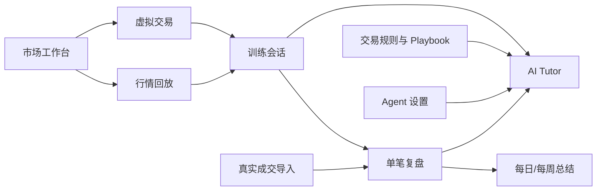

# ReplayTutor 产品与交互设计

实施注记（2026-08-02）：工作台指标入口已实现 27 个 KLineChart 内置指标和 VWAP、ATR、
连续 Bar Count、非重画 Order Block。每个图表窗格维护独立实例与参数，支持一键复制到
全部窗格；配置属于本地显示偏好。当前切片只把服务端已经裁剪的 bars 交给图表指标实现，
MA、EMA、VOL、OBV、VWAP、ATR、Bar Count、Order Block 已可显式加入 Tutor Context
Tray，由服务端在当前 frame 重新计算；其他内置指标目前只显示，不会伪装成 Tutor 证据。

实施注记（2026-08-02）：绘图工具升级为 40 项专业核心目录。第一锚点后必须实时预览；
正式工具必须支持选择、控制点编辑、保存恢复、样式修订、复制、锁定、隐藏、删除及
Tutor 上下文。缺少 renderer 或注册契约的工具不得显示为正式可用。

左侧工具栏按任务拆分为线类、斐波那契、预测与测量、图形形态四个工具族；预测与测量
内部再区分仓位预测、成交量和范围测量。放大、缩小直接控制当前活动窗格，不属于绘图工具，
也不产生持久化图表对象。

> Public locales are `en-US` and `zh-CN`, with English fallback. User-facing fixed copy, formatting, API errors, reports, and Tutor prose respect the selected locale. User-authored content stays verbatim.

状态：Approved v1.0  
更新时间：2026-07-19  
工作标题：ReplayTutor

视觉、布局、颜色、字体、组件和响应式规范以仓库根目录 [DESIGN.md](../DESIGN.md) 为唯一真源。本文件定义产品行为与用户流程。

全页面信息架构、页面状态、跨页交互与可点击原型见
[全页面与交互设计](plans/2026-07-30-replaytutor-page-interaction-design.md)。

## 1. 产品定义

ReplayTutor 是“专业图表工作台 + 历史行情训练器 + 交易日志 + AI 教练”。它不直接替用户做交易决策，而是让用户在可复现的市场环境中练习、留下完整操作证据，并得到有依据的复盘。

产品要解决的不是“再做一个 K 线网站”，而是三个断裂问题：

1. 图表与交易记录分离，用户很难还原当时为什么买卖。
2. 回放工具只统计盈亏，不理解用户的交易计划和行为。
3. 普通聊天模型看不到确定性的成交过程，容易给出后见之明式空话。

## 2. 目标用户与任务

### 2.1 核心用户

- 希望通过逐 K 训练建立稳定交易规则的个人交易者。
- 同时关注 A 股、美股、加密或外汇，需要统一工作台的用户。
- 已经有真实成交记录，希望复盘买卖时机、仓位和纪律的用户。
- 已经使用 Codex，希望复用现有登录态与本地能力的用户。

### 2.2 核心任务

- “随机给我一段未知行情，我按自己的方法完成一场交易训练。”
- “回放我昨天的真实操作，告诉我在哪些地方违反了计划。”
- “不要只告诉我盈亏，解释我的入场、加仓、止损和退出质量。”
- “总结我最近 20 次交易反复出现的问题，并给下一周一个训练重点。”
- “用我已经登录的 Codex 做 Tutor，不要求重复购买同一个模型的 API。”

## 3. 产品原则

### 3.1 证据先于观点

所有 AI 评价必须关联至少一种证据：行情时间点、订单、成交、仓位变化、用户计划、计算指标或用户笔记。没有证据时，AI 必须明确说“信息不足”。

### 3.2 严格区分两个时间视角

| 模式 | AI 可见数据 | 用途 |
|---|---|---|
| 回放中 Tutor | 当前回放游标及之前的数据 | 提问、提示、解释当下结构 |
| 事后 Reviewer | 整段行情、完整订单和最终结果 | MFE/MAE、退出效率、行为模式总结 |

UI 必须持续显示当前处于哪种模式。回放中 Tutor 禁止读取后续 K 线、最终盈亏和事后指标。

### 3.3 计算与解释分离

- 撮合、手续费、盈亏、滑点、MFE/MAE、胜率、期望值由确定性模块计算。
- AI Tutor 消费结构化结果并解释，不自行编造数值。
- AI 的判断以“观察 / 推断 / 建议”分栏呈现。

### 3.4 多市场一致，规则不混用

统一使用相同工作台，但按市场加载不同规则：

- A 股：交易日历、集合竞价、T+1、100 股一手、涨跌停和复权。
- 美股：盘前/盘后、拆股分红、不同交易所日历和美元计价。
- 加密：7×24、交易所差异、现货与合约、资金费率和不同 tick/lot size。
- 外汇：5×24、交易时段、点值、合约单位、点差和隔夜成本。

### 3.5 本地优先与可替换

交易数据和 Agent 会话默认留在本机。行情源、模型和 Coding Agent 都通过适配器替换，不把产品逻辑绑定在单一供应商上。

## 4. 核心信息架构



主导航：

1. **工作台**：看图、回放、下虚拟单、与 Tutor 对话。
2. **交易日志**：真实交易与训练交易统一查询。
3. **复盘中心**：单笔、单日、单周报告及行为模式。
4. **Playbook**：交易策略、入场检查表、风险规则。
5. **数据中心**：市场数据覆盖、导入、同步和质量。
6. **AI 设置**：Codex CLI 检测、权限边界、AI 总开关、运行目录保留期和
   local-only 隐私状态。设置页同时提供 SQLite 备份恢复；会话删除进入可恢复
   回收站，不直接抹除订单、证据或复盘。

## 5. 桌面工作台

### 5.1 布局

采用 TradingView 式图表工作台范式：顶部上下文工具栏、左侧绘图工具栏、中央弹性图表、右侧工具坞、回放控制条和底部交易面板。

- 图表始终获得剩余空间，不再保留常驻左侧自选列表。
- 自选、Tutor、证据、Playbook、品种详情和数据质量进入右侧可切换工具坞。
- 订单、持仓、成交、P&L、笔记和事件进入可调高度的底部面板。
- Tutor 在回放中默认打开，自选在普通浏览状态默认打开。
- 精确尺寸、折叠行为和响应式规则见 [视觉与交互设计系统](../DESIGN.md#3-应用外壳)。

### 5.2 图表交互

- K 线、折线、面积图；成交量和多个副图。
- 顶部指标面板支持中英文搜索、主图/副图分类、重复实例、参数、显隐、删除和应用到全部
  窗格。首次使用默认创建可删除的成交量副图。
- 图表内指标图例默认显示名称、参数和当前数值；每个窗格左上角提供带可见指标数量的
  收起/展开按钮。收起只隐藏图例文字，不隐藏指标图形，也不改变 Tutor 上下文或计算。
- 连续 Bar Count 从训练会话首根完整可见 K 线编号；缩放过密时仅抽稀标签，不改变编号。
- Order Block 采用已确认摆点、ATR 位移和收盘突破结构的确定性规则，确认前不显示，确认后
  不回填到历史 K 线也不重画；触碰与失效只由后续完整可见 K 线更新。
- 支持单图、左右双图、上下双图和四图布局；每个窗格可独立选择
  `1m / 5m / 15m / 1h / 4h / 1d`，但全部共享同一个服务端 ReplayFrame 和
  `visible_at`。活动窗格接收周期快捷键、缩放、复位与新绘图操作。
- 周期切换只读取服务端按当前会话 `visible_at` 聚合的窗口，不改变 1m 回放与撮合游标。
- 十字光标、磁吸、趋势线、射线、延长线、价格线、水平线、水平射线、垂直线、
  平行通道、等距价格通道、斐波那契回撤、价格测量、矩形和文字标注。
- 左侧工具栏使用图标分组，选中工具后在图内显示采点顺序、完成进度和 `Esc` 取消提示；
  鼠标悬停或键盘聚焦图标时显示工具名称和操作说明；磁吸开启时，锚点吸附到最近
  一根可见 K 线的 OHLC。
- 线类工具使用分组面板渐进展开，并记住最近使用的子工具。两点及三点工具在第一次
  点击后立即创建仅存在于前端的预览对象，后续锚点随鼠标位置实时更新；完成全部采点
  后才提交持久化标注。
- 计划开仓、加仓、减仓、计划平仓、止损、止盈和风险收益框是有业务语义的图表
  对象，不得退化为只有颜色区别的普通 marker。
- 多头/空头仓位计划均按“入场、止损、目标”三点创建，方向关系不合法时不得保存；
  风险收益比由这三个价格确定性计算并随图表对象保存。
- 任意已注册图表对象均可加入右侧 Tutor 的 Context Tray；默认只发送用户显式
  选择的对象，清空对话上下文不得删除图表对象。
- 绘图草稿只存在前端；完成所需采点后才提交，`Esc` 取消且不写入事件。
- 用户图表对象默认可拖拽控制点；仓位计划分别提供入场、止损和目标控制点。锁定
  图层后停止响应拖拽。悬停已有对象时显示名称和类型，点击对象后在图内显示删除入口；
  工具栏删除、图内删除、撤销和重做仍通过追加式处置事件完成，不原地覆盖原始对象。
- 用户标注与 AI 建议分层展示。AI 建议默认 `proposed`，必须经 Inspector
  接受、拒绝或修改；修改与删除保留不可变原始对象和处置历史。
- 买入、卖出、加仓、减仓、止损、止盈以不同图标显示。
- 点击成交标记打开“该时刻上下文”：订单、仓位、计划、笔记、Tutor 评论。
- 复盘证据行是可访问的深链接；进入只读 REVIEW 工作台后定位时间、价格和实体，
  刷新保持同一证据，返回时焦点回到原证据行。
- 图表上不得默认显示未来成交或未来注释。
- 客户端禁止在未来留白区创建锚点，服务端仍以当前帧 `visible_at` 做最终校验。
- 修订对象时，标签、坐标和有效 metadata 必须在同一处置事件中更新，避免图形与
  Tutor Context Tray 中的仓位参数或测量结果不一致。
- 主图右侧价格轴悬停时显示精确价格、贯穿主图且随指针上下移动的水平引导线和 `+` 按钮；
  点击 `+` 打开操作菜单并可在该刻度创建水平线。价格由 KLineChart 当前 Y 轴坐标换算，时间锚点固定为最后一根
  可见 K 线；创建后复用普通用户图表对象的持久化、样式、撤销和 Tutor Context 链路，
  REVIEW 模式保持只读。
- 工作台提供统一快捷键解析层和 `Cmd/Ctrl + K` 命令面板。画线、周期、视口、回放与
  图层操作可以由键盘触发；交易快捷键只修改订单草稿，不直接调用提交接口。
- 快捷键同样受 `visible_at`、会话 revision 和计划门禁约束。向后跳转、指定未来日期、
  会话内静默换品种等不安全操作不绑定快捷键，并在帮助面板说明原因。

### 5.3 回放控制

状态机：

```text
idle → loading → ready → playing ⇄ paused → completed
                    ↘ seeking ↗          ↘ stopped
```

控制项：

- 选择品种、周期、开始日期、初始资金和手续费模型。
- 隐藏未来数据后开始；支持逐根、定速播放、暂停和安全跳转。
- 随机训练模式只显示市场与周期，不显示具体日期，降低记忆偏差。
- 每次回放生成不可变 `replay_seed` 与数据快照版本，确保可复现。
- 改变撮合规则或数据版本后，旧会话仍按原版本重放。
- 用户看见一根完整 K 线后提交的订单，最早从下一根参与撮合；禁止使用已经显示的当前柱高低价回填成交。
- 回放中的自选报价、详情、指标、P&L 和 Tutor 全部服从同一 `visible_at`，不得混入实时数据。

### 5.4 虚拟交易

MVP 订单类型：

- 市价单
- 限价单
- 止损市价单
- 止损限价单（第二阶段）

下单面板必须显示：方向、数量、名义金额、预计手续费、止损、风险金额、占账户比例、市场规则提示。

- 右侧交易决策台使用专业订单票据的信息层级：双向买卖报价、常用订单类型页签、价格与
  数量、退出设置和订单摘要。它借鉴成熟交易终端的操作范式，但使用 ReplayTutor 自有视觉、
  文案和图标。
- 强制计划门禁与订单票据合并呈现。计划未锁定时，用户在同一面板填写交易逻辑、失效条件、
  风险和可选的入场/止损/目标；锁定后，计划保留为可展开的证据摘要，不因进入下单阶段消失。
- 图表上选中的多头仓位、空头仓位或风险收益框可作为计划种子，一键预填方向、入场、止损、
  目标和 R:R，并加入下一轮 AI 图表上下文。用户仍需亲自填写理由和失效条件。
- `订单 / 市场深度` 在同一交易决策台切换。市场深度展示买卖档、单档数量、累计量、价差、
  中间价、来源和采集时间；超过 60 秒的时点快照必须标为陈旧。
- 右侧固定 40px 工具栏提供“交易 / Chat”入口；点击当前入口折叠，点击另一个入口原位切换。
  两个面板保持挂载，中央图表随网格自动扩展，布局偏好仅保存在浏览器本地。
- 回放盘口只能读取数据集中 `captured_at <= visible_at` 的 L2 快照。只有 OHLCV 时显示
  “历史 L2 未采集”，禁止用当前实时盘口替代，也禁止从 K 线估算或虚构盘口。

撮合结果不能只给“成交/失败”，还要返回原因：价格未触达、市场休市、T+1 不允许卖出、数量不满足 lot size、触及涨跌停无可成交假设等。

### 5.5 右侧 AI Tutor

Chat 面板采用双栏会话布局：左侧是当前回放 Session 的线程历史，右侧是当前对话和固定在
底部的输入区。支持新建、切换、重命名和软删除；刷新后恢复最后打开的线程。低于 1180px
时右侧面板改为覆盖式抽屉，不压缩图表到不可用宽度。

每轮回答内部保留四类结构：

1. **对话**：围绕当前图表与操作提问。
2. **证据**：AI 引用的 K 线、成交、指标、规则和笔记。
3. **检查表**：当前 Playbook 的入场、持仓、退出规则。
4. **报告**：单笔/会话复盘的结构化结论。

检查表状态由确定性评估器计算并显示 `passed / failed / unknown`。通过或失败项
必须链接到计划、订单、成交或 K 线证据；未映射的自由文本规则显示 `unknown`，
不得由 Tutor 代替规则引擎判断。

Tutor 的回答模板：

```text
结论：一句话回答当前问题
观察：可验证的行情与操作事实
推断：基于哪些规则得出的判断
风险：数据不足、替代解释、当前未知项
下一问：促使用户陈述自己的计划，不直接替用户下决定
```

AI 不使用“必涨、必跌、稳赚”等表达，不替用户自动提交真实或虚拟订单。

Tutor 请求可携带最多 32 个选中标注 ID。客户端不能直接拼装对象坐标或行情证据；
服务端按当前 `frame_id` 解析有效对象，生成不可变 `ChartContextBundle`，并把相关
已可见 K 线与对象 ID 加入证据白名单。回答应先复述所理解的图形关系，再评价用户
陈述，避免把计划标记误认为真实成交。

## 6. AI 复盘输出

### 6.1 单笔交易报告

- 交易目标与用户原计划。
- 入场位置、入场后 MAE/MFE、风险收益比。
- 加减仓是否符合 Playbook。
- 止损执行、退出效率和滑点。
- 当时可见信息下的合理性评价。
- 做对、做错、运气成分、下次动作各一项。
- 证据链接：跳转回对应 K 线和订单事件。

### 6.2 会话/每日总结

- 操作时间线和净值曲线。
- 交易次数、胜率、盈亏比、期望值、最大回撤。
- 计划内与计划外交易占比。
- 追涨、亏损加仓、过早止盈、移动止损、报复性交易等行为标签。
- “如果只做 A 级机会”的反事实统计；必须由规则过滤器计算，不能让 LLM 猜。
- 明日只给 1–3 个可执行改进点。

### 6.3 周期总结

- 按市场、品种、时段、Playbook、方向、持仓时长分组。
- 五维能力分数必须展示样本数和 passed/evaluated 原始计数；每维少于 5 个可解析
  会话时显示“不足”，不绘制默认分数。
- 推荐训练来自最低的确定性能力维度，并说明样本数、原因和绑定 Playbook；盈利
  排名不能进入推荐算法。
- 识别重复出现的纪律问题，并展示样本数和置信度。
- 区分“小样本提示”和“稳定模式”。
- 生成下周训练计划：选择场景、训练次数、通过标准。

## 7. 数据导入体验

### 7.1 行情数据

数据中心显示每个品种的：来源、覆盖区间、粒度、复权方式、最后同步、缺口、许可/订阅状态。

创建训练时不要求用户先进入数据中心。用户选择 BTCUSDT 或 ETHUSDT、现货/USDT
永续市场及历史范围后，应用先匹配本地同品种、同市场、同周期、质量可用且覆盖
期足够的最新 Snapshot；历史范围默认 30 天，也可选择 1 年。命中后将最新版本标记为推荐，
未命中或覆盖不足才从 Binance 公开接口下载所选范围的完整 1 分钟 K 线。
存在多个本地 Snapshot 时，训练配置必须列出版本 ID、覆盖区间、创建时间和质量，允许
用户显式选择；推荐不等于确认。用户未点击 Snapshot 前，账户、起点、策略和创建按钮
保持锁定，不得自动推进到最后一步。用户可选择从数据开头、指定 UTC 日期时间或随机
片段开始；指定时间必须落在所选 Snapshot 内，并为预热窗口和至少一根未来 K 线留足空间。
下载与质量校验进入可跨页面运行的持久后台任务；应用外壳持续显示进度，用户可以切换
页面或刷新。任务完成后生成不可变 Snapshot，用户回到训练配置页再显式创建会话，
系统不得在用户浏览其他页面时突然跳转。下载失败不得写入空 Snapshot、不得回退到
其他市场的数据，也不得使用随机价格填充。

数据中心允许删除未被训练会话引用的 Snapshot。删除前必须确认，Parquet 目录先移动
到本地回收目录；任何仍被历史或进行中会话引用的 Snapshot 必须拒绝删除，以维持回放
指纹、订单、账本和证据可重建。

来源可以是公开接口、交易所/券商接口、付费数据商或用户文件；产品不承诺所有市场免费实时数据。

### 7.2 真实成交

首期支持标准 CSV 模板和手工录入；随后增加券商专用导入器。导入流程：

```text
上传 → 字段识别 → 品种映射 → 时区/币种确认 → 去重预览 → 用户确认 → 写入
```

任何不确定映射都进入待确认列表，禁止静默猜测。

## 8. 视觉系统

方向已经锁定为 TradingView 式高密度专业工作台，暗色优先、工业化、克制、图表主导。所有具体 Token、字体、布局、动效、图标、响应式和验收门禁统一维护在根目录 [DESIGN.md](../DESIGN.md)，本文件不再复制一份容易漂移的 Token 表。

### 8.1 Do / Don't

**Do**

- 让回放时间、数据来源和 Tutor 时间视角始终可见。
- 所有 AI 结论都能跳回证据。
- 在下单前显示风险金额和市场规则。
- 使用快捷键服务高频操作。

**Don't**

- 不复制 TradingView Logo、专有图标或像素级界面。
- 不用红绿颜色作为唯一状态信号。
- 不在回放中泄露未来事件、最终收益或后续 K 线。
- 不把 LLM 文本当作撮合、盈亏或风控的真源。

## 9. MVP 验收场景

### 场景 A：加密确定性纵向切片

用户选择 BTCUSDT 固定数据快照，设置手续费和滑点，使用限价单入场、止损退出。重开相同回放指纹后，完整事件流、订单、账本与结果完全一致；Codex 基于合法证据生成单笔复盘。

### 场景 B：A 股规则扩展

用户选择一只 A 股日线/分钟线与历史日期，系统隐藏未来数据。用户逐根播放、买入并尝试当日卖出；系统依据 T+1 拒绝卖出并解释规则。结束后 AI 基于完整行情给出单笔复盘。

### 场景 C：原生 Agent 结构化复盘

Codex 消费经过裁剪的 `TutorContext` 并返回合法 `TutorResponse`；无效证据引用和越界图形坐标被拒绝，Codex 失败不改变交易与指标真源。MVP 不实现其他 Agent。

## 10. 路线图

### Phase 0：可点击原型

- 顶部工具栏、左侧绘图栏、中央图表、右侧 Tutor 工具坞、回放条和底部交易面板。
- 确认核心信息密度和交互路径。

### Phase 1A：确定性纵向切片

- BTCUSDT 固定快照、1 分钟单图回放和会话保存。
- 市价、限价、止损市价撮合与事件账本。
- Codex 绑定、单笔 AI 复盘和证据回跳。
- Golden Session、未来数据诱饵、账本平衡和重放一致性门禁。

### Phase 1B：第二市场与产品硬化

- A 股历史 K 线、交易日历、lot size、涨跌停和 T+1。
- Codex Adapter 兼容性、恢复、隔离和错误救援硬化。
- 多周期切换、当日复盘和 Playbook 检查表。

### Phase 2：真实成交与更多市场

- 标准 CSV 与券商导入器。
- 美股、外汇市场适配器。
- Playbook、统计分析、周期报告。

### Phase 3：专业能力

- tick/L2 回放、多图十字光标与视口同步、期权/合约规则。
- 团队教练模板、可分享只读复盘。
- 可选云同步，但仍保留完整本地模式。

## 11. 成功指标

- 用户完成一次回放并生成复盘的中位时间低于 15 分钟。
- 95% 以上 AI 评价含可点击证据。
- 同一数据快照、规则版本和 `replay_seed` 的重放结果 100% 一致。
- 行情未来数据泄露测试为零失败。
- 用户能在 3 分钟内完成一个已登录 Coding Agent 的绑定检测。
- 周复盘能够用样本明确区分稳定模式与偶然事件。
