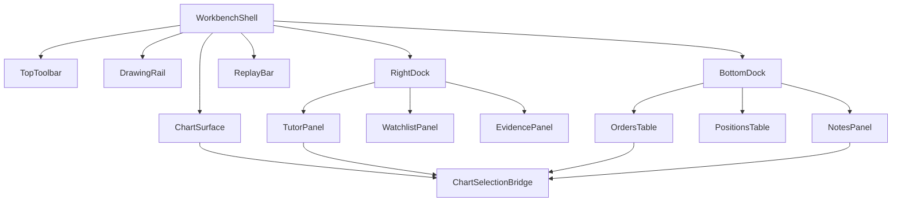
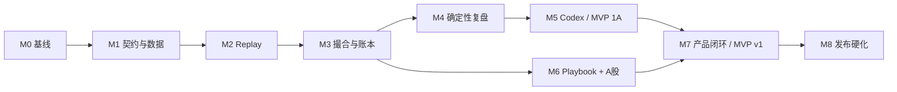

# ReplayTutor MVP v1 实施计划

状态：Approved for implementation v1.0  
更新时间：2026-07-31
覆盖范围：MVP v1 产品功能、前端、后端、数据、Agent、测试与本地交付  
上游真源：[视觉设计](../DESIGN.md) · [产品设计](DESIGN.md) · [系统架构](SYSTEM_ARCHITECTURE.md) · [Agent 契约](AGENT_BINDING.md)

当前开发批次、页面交付顺序与第一批 Backlog 见
[产品化实施计划 v2](plans/2026-07-30-replaytutor-implementation-plan-v2.md)。

## 当前实施状态

- M0：完成。
- M1：完成第一批纵向交付，包括 Pydantic → JSON Schema → TypeScript/Ajv 生成链、真实 BTCUSDT 2025-01 Golden Dataset、Binance Public Adapter、CSV/Parquet 导入预览与提交、不可变 Parquet Snapshot、DuckDB 查询和真实数据中心页面。
- M1 数据下载增强：Binance 下载已改为 SQLite 持久后台任务；跨页面继续运行，AppShell
  展示全局进度，应用重启恢复未完成任务，成功后发布 Snapshot 并由用户显式开始训练。
- Binance 只读复盘切片：已完成 U 本位近 6 个月 Fill/账务同步、Fill 去重、Episode 重建、五周期价格行为标注、反前视门禁、离线 HTML、API/CLI 与 `/reviews` 页面。离线报告图表支持滚轮/按钮缩放、拖拽平移、视窗复位和结构标签碰撞避让。币安当前 `allOrders` 普通查询限制为最近 90 天，因此更早成交的订单元数据会明确标记 `partial`；年度异步导出接口已封装，跨 6 个月历史的自动下载恢复仍作为后续增强。
- M2：完成 Session/Replay 纵向切片，包括服务端 `frame_id`/`visible_at`、revision 与命令幂等、真实 Snapshot 可见窗口、推进/结束/恢复 REST、训练配置页、KLineChart 回放工作台和单飞播放器。浏览器验收已覆盖“创建 → 推进 → 刷新恢复”，图表仅渲染可见 bars。
- M3–M5：完成 MVP 1A 核心纵向闭环。包含 bracket/OCO、取消订单、订单与成交 Overlay、用户/AI 图层、确定性 MFE/MAE/R/回撤/退出效率、Codex 回放中与事后审查、完整绘图、证据回跳、AI 标注处置、版本化 Playbook 确定性规则检查、五维训练聚合/推荐和隔离浏览器 E2E。完整 MVP v1 仍需经过 H5 本地产品硬化与发布封板。
- 专业绘图批次：40 项工具已进入统一注册目录；自定义矩形、风险收益、层级和多段线
  Overlay 替代无效 `rect`，对象 V2 契约和 0017 迁移已落地，支持持久样式、复制、锁定、
  隐藏、删除、工具模板与偏好。左栏已按线类、斐波那契、预测与测量、图形形态拆分，
  并补充活动窗格直接放大和缩小。正式发布仍以每项工具完整浏览器生命周期矩阵为门禁。
- 工作台快捷键批次：已接入命令面板、快捷键帮助、常用画线、周期直输、图表视口、
  回放推进、图层显隐及绘图复制/删除。模拟交易快捷键只预填订单草稿并保留显式提交；
  回退、未来日期和会话内换品种等不安全动作不做假实现。
- 多图工作区批次：已接入单图、左右双图、上下双图和四图布局。各窗格独立周期，活动
  窗格接收快捷键与绘图，所有窗格共享同一服务端 frame 与 `visible_at`；布局偏好不进入
  确定性交易结果。
- 指标工作台第一切片：已接入 KLineChart 10.0.0 的 27 个内置指标，以及 VWAP、ATR、
  连续 Bar Count 和确认后不重画的 Order Block。支持窗格独立配置、中英文搜索、参数、
  显隐、删除、应用到全部窗格和本地恢复；默认显示可删除的成交量副图。MA、EMA、VOL、
  OBV、VWAP、ATR、Bar Count、Order Block 支持显式加入 Context Tray，服务端按签名 frame
  重新计算版本化 IndicatorEvidence；其余内置指标暂不进入 Tutor，不把浏览器值当证据。
- 本地试用硬化：完成可恢复会话删除、偏好/隐私、SQLite 备份恢复、Agent orphan 收敛、三宽度/axe 验收与构建产物扫描。后续 M6–M8 等待真实用户试用反馈后启动；A 股规则和 Post-MVP 能力不计入当前 Codex-only 交付。

M1 Golden Dataset 固定为 `2025-01-01T00:00:00Z` 至 `2025-02-01T00:00:00Z` 的 BTCUSDT 1m 数据，共 44,640 根。仓库 fixture manifest 保存来源请求、抓取时间、源字段 hash、Parquet hash 和质量摘要；运行时载入生成新的不可变 Snapshot，fixture 本身不被修改。

## 1. 交付定义

MVP v1 不是一个静态图表 Demo。完成标准是用户能够在本机完成下面这条闭环：

```text
准备历史数据 → 创建隐藏未来的训练会话 → 逐根回放
→ 提交虚拟订单 → 得到确定性成交与账本 → 写下交易理由
→ 在回放中询问 Tutor → 结束会话 → 查看带证据的单笔/会话复盘
→ 关闭应用 → 重开并恢复同一会话与同一结果
```

MVP v1 由两个连续发布门组成：

- **MVP 1A：确定性纵向切片**。BTCUSDT、1 分钟、固定快照、Crypto Spot 规则、Codex Tutor。
- **MVP 1B：完整 MVP v1**。加入 A 股规则与数据导入、Playbook、当日/会话报告；AI 仍只接入 Codex。

1A 是第一份可运行软件，1B 是对外称为 MVP v1 的完整版本。两个阶段共享同一契约和数据模型，不做一次性 Demo 实现。

## 2. 不可违反的系统不变量

| ID | 不变量 | 实现门禁 |
|---|---|---|
| INV-01 | 回放中任何响应不得包含 `visible_at` 之后的数据 | 服务端裁剪、响应扫描、未来诱饵测试 |
| INV-02 | 图表、订单、账户、Tutor 共用服务端签发的 `frame_id` | 客户端不能提交自定义 `visible_at` |
| INV-03 | 看见完整 K 线后提交的订单最早从下一根激活 | `activated_at = next_bar.open_time` 属性测试 |
| INV-04 | 相同回放指纹产生完全相同的市场、订单、成交与账本事件 | Golden Session 事件流 hash |
| INV-05 | 金额、价格、数量和费用不用二进制浮点作为真源 | 后端 Decimal，JSON 使用字符串 |
| INV-06 | AI 不计算或修改订单、成交、账本和指标 | Tutor 只读证据包，响应 Schema 白名单 |
| INV-07 | 账本可由不可变事件重建并保持平衡 | 每次事务校验 + 重建测试 |
| INV-08 | 市场差异只进入 Market Rules Adapter | UI 与训练编排模块禁止市场条件分支 |
| INV-09 | 原始价格用于撮合，复权价格只用于明确标注的展示/分析 | raw/adjusted 双轨契约测试 |
| INV-10 | Agent 失败不得阻塞回放和虚拟交易 | 独立任务状态、超时、取消和降级 E2E |

## 3. MVP 功能范围

### 3.1 首次启动与本机健康检查

- 展示 API、SQLite、行情目录和 Codex 的检测结果。
- 数据目录不存在时安全创建；数据库通过迁移初始化。
- Agent 状态区分：未安装、认证未知、未认证、可用、自检失败。
- 缺少 Agent 不阻止用户使用回放和确定性复盘指标。
- 提供“载入示例数据”入口，写入版本化 BTCUSDT Golden Dataset。

### 3.2 数据中心

MVP 支持三种数据入口：

1. 内置 Golden Dataset，用于第一天即可训练和自动验收。
2. Binance Public Adapter，按品种、1m 时间范围获取加密现货与 USDT 永续 OHLCV。
3. 标准 OHLCV CSV/Parquet 导入，用于 A 股和用户自有历史数据。

功能包括：

- 数据集列表、品种、市场、周期、覆盖区间、来源、快照版本和质量状态。
- 训练配置页选择 BTCUSDT/ETHUSDT、市场类型与历史范围后匹配覆盖足够的本地
  Snapshot 并标记推荐版本，但必须由用户显式点击确认；范围默认 30 天，也可选择 1 年。
  无匹配数据或覆盖不足时创建对应范围的
  Binance 公开 1m 行情后台任务，校验通过后生成 Snapshot；用户回到训练配置页再
  显式创建会话，后台完成不得强制页面跳转。
- 本地存在候选 Snapshot 时，显示版本 ID、覆盖区间、创建时间与质量并要求显式选择；
  未选择前不展开后续配置，创建请求必须携带用户最终选择的 `snapshot_id`。
- 导入预览：列映射、时区、价格精度、重复、缺口、乱序、异常值。
- 用户确认后标准化为不可变 Parquet 快照。
- 原始文件保留 hash 和来源；任何更新生成新 snapshot，不覆盖旧文件。
- 用户可删除未被训练会话引用的 Snapshot；文件先移入本地回收目录。被任一会话引用时
  必须拒绝删除，不允许级联破坏历史回放。
- MVP 只支持 `1m` 原始数据；`5m/15m/1h/4h/1d` 由后端按固定规则聚合。
- A 股导入必须确认交易所、时区、复权类型和 corporate action 信息；不确定项不得静默猜测。

### 3.3 品种与训练创建

- 快速品种选择：BTCUSDT、ETHUSDT；默认 USDT 永续，也可切换现货。
- 训练创建不以手工导入为前置步骤；本地可用数据优先，缺失时自动下载。
- 创建方式：从数据开头、指定 UTC 开始时间或随机片段。指定时间由服务端映射到所选
  Snapshot 的首个同刻或后续 1m bar，并校验预热 bars 与至少一根未来 bar。
- 随机训练隐藏真实日期，结束后揭示。
- 配置：初始资金、手续费模型、滑点 bps、回放速度、撮合策略。
- 创建前展示数据质量、覆盖长度和规则版本。
- 数据不足、存在关键缺口或无后续 K 线时拒绝创建并说明原因。

### 3.4 工作台与图表

- TradingView 式应用壳：顶部工具栏、左侧绘图栏、中央图表、右侧工具坞、回放条、底部面板。
- K 线、成交量、十字光标、价格/时间轴缩放、拖动画布。
- 周期：1m、5m、15m、1h、4h、1d；切换只使用当前 snapshot 在 `visible_at` 内的派生数据。
- 布局：单图、左右双图、上下双图、四图；各窗格周期独立，回放帧、品种、订单、成交
  与图层状态同步。活动窗格接收快捷键、缩放、复位和新绘图操作。
- 绘图：线类分组支持趋势线、射线、延长线、价格线、水平/垂直线和平行/价格通道；
  第一点后实时预览，完成采点后才保存。矩形、文字等对象支持选择、锁定、隐藏、删除。
- 买入、卖出、止损、止盈、拒单和证据标记。
- 图表右侧未来区域保持空白，蓝色边界显示 `Visible to`。
- 选择成交、订单、笔记或证据后，图表与底部表格双向定位。
- 图表样式和布局偏好本地持久化，不进入确定性交易结果。

### 3.5 回放控制

- 状态：`idle → loading → ready → playing ⇄ paused → completed/stopped`。
- 播放、暂停、逐根前进、1×/2×/5×/10×/20×。
- 前端播放器保持最多一个未完成 command，防止快进请求乱序。
- 每个 command 带 `expected_revision`；过期命令返回冲突并拉取最新状态。
- 10×/20× 可批量 advance，但返回所有产生的订单/成交事件和最新 frame。
- 会话自动保存；应用关闭后恢复到最后提交成功的 revision。
- 修改品种、snapshot、周期或规则必须新建会话。

### 3.6 虚拟交易

订单类型：

- 市价单
- 限价单
- 止损市价单
- 附带止损/止盈的 bracket；父单成交后激活，兄弟单 OCO

行为：

- Crypto Spot 与 A 股现金账户只允许买入已有资金、卖出已有持仓；MVP 不支持裸空和杠杆。
- OHLCV 模式不模拟部分成交，订单要么完全成交、继续工作、取消、到期或拒绝。
- 市价单在下一根开盘加入滑点后成交。
- 限价单触达后按限价成交；不授予跳空形成的有利改善，保证保守性。
- 止损市价单触发后按 `max/min(stop, next tradable price)` 加不利滑点成交。
- 同根止盈和止损均触发时采用不利路径，并记录 `ambiguous_bar_conservative`。
- 订单草稿可以在票据和图表上同步编辑，但只有显式确认才提交。
- 支持取消工作订单；修改订单采用 cancel + replace 事件，不原地覆盖。

Crypto Spot 规则：tick size、step size、最小名义金额、maker/taker 费用、7×24。

A 股规则：交易日历、集合竞价状态、100 股整手买入、零股卖出策略、tick size、T+1 可卖数量、涨跌停、佣金最低额、印花税和过户费版本。MVP 不模拟涨跌停排队成交，没有可靠流动性证据时保守拒绝。

### 3.7 账户、账本与指标

- 展示现金、持仓数量、可卖数量、平均成本、已实现/未实现 P&L、费用和净值。
- 使用移动加权平均成本；部分卖出按持仓平均成本释放成本。
- 每次成交生成平衡的 journal：现金、持仓成本、费用、已实现盈亏。
- 持仓数量从成交与 settlement 事件重建，账面金额从 journal 重建。
- 会话中指标：净 P&L、总费用、胜率仅在样本允许时显示、最大回撤、持仓时长。
- 事后指标：MFE、MAE、退出效率、计划规则命中和数据质量说明。
- 反事实统计和跨会话稳定模式不进入 MVP v1。

### 3.8 笔记与 Playbook

- 当前 frame 快速笔记，自动关联 `frame_id`、品种和可见时间。
- 下单前可填写交易理由、无效条件和风险计划。
- Playbook CRUD：名称、市场、入场规则、持仓规则、退出规则、风险上限。
- MVP 规则是人工勾选或确定性可计算规则，不提供任意脚本执行。
- 会话绑定一个 Playbook 版本；修改 Playbook 不改变历史会话。
- 报告中区分计划内、计划外和信息不足。

### 3.9 AI Tutor

回放中：

- 基于当前 frame 提问。
- 快捷问题：评价当前入场、检查计划、解释拒单、总结当前风险。
- 物理删除未来 K 线、后续成交、最终 P&L、MFE/MAE。
- 回答分为结论、观察、推断、风险/未知、规则检查、下一问。

事后：

- 用户显式结束会话后才进入 `after_action`。
- 允许消费完整会话、确定性指标、笔记和 Playbook 检查结果。
- 生成单笔和会话报告，所有事实性结论必须带 evidence ID。

Agent：

- MVP 1A 和 1B 都只接入 Codex CLI。
- Claude Code、Kimi 和其他 Agent Adapter 全部延后到 Post-MVP。
- 文件证据包、只读工作目录、结构化 Schema、事件流、取消和 180 秒超时。
- 不合法 JSON 或无效 evidence ID 不能作为合格报告；UI 可展示“未校验原始输出”但不得混入正式报告。

### 3.10 会话库与复盘页

- 会话列表：市场、品种、时间、状态、交易次数、净 P&L、规则版本和数据质量。
- 支持继续未完成会话、查看已完成会话、软删除会话。
- 复盘页包含时间线、净值曲线、订单/成交、指标、笔记、Playbook 检查和 Tutor 报告。
- 点击任意证据回到只读图表的对应 frame。
- 删除会话先进入回收状态；原始 snapshot 不因删除一个会话而删除。

### 3.11 设置

- 暗色/亮色、涨跌颜色偏好、默认资金、费用和滑点。
- Agent 检测、重新检测、最小自检、默认 Agent。
- 数据与运行目录位置只读展示；打开目录和清理 Agent 临时产物。
- 隐私设置：是否保留完整 TutorContext、原始 Agent 输出和 stderr。
- MVP 不提供云同步、真实券商密钥或真实交易权限。

## 4. MVP 明确不做

- 实时行情、真实下单、券商登录、跟单和收益承诺。
- 美股、外汇、期货、永续合约、期权、保证金和裸空。
- 已实现时点 L2 的 Binance REST 采集、历史导入、`visible_at` 防泄漏查询和盘口展示；
  WebSocket 增量簿、tick 驱动部分成交与排队模型仍属于后续执行仿真阶段。
- TradingView Pine Script、闭源图表库、告警系统和社区内容。
- 多图十字光标/视口同步、多人协作、分享链接、云同步和移动端完整交易。
- 券商真实成交导入、跨会话周/月稳定模式和自动策略回测。
- 任意用户脚本、Agent 写入交易数据、Agent 自主下单。

## 5. 前端架构

### 5.1 技术栈

| 能力 | 选择 | 约束 |
|---|---|---|
| 应用 | React + Vite + TypeScript strict | Node 24 LTS/Current 环境，依赖按 lockfile 固定 |
| 路由 | React Router | 页面级 lazy import |
| 服务端状态 | TanStack Query | frame 和账户状态不进入自定义缓存真源 |
| 本地交互状态 | Zustand | 只存布局、工具选择、草稿和用户偏好 |
| 图表 | KLineChart | 只用开源内核和自有 Overlay/图标 |
| 表单 | React Hook Form + Zod | 仅处理前端表单体验，服务端仍做最终验证 |
| Schema | 生成的 TypeScript 类型 + Ajv | JSON Schema 来自后端 Pydantic 真源 |
| 样式 | CSS Modules + CSS variables | Token 来自根目录 `DESIGN.md` |
| 可访问原语 | Radix primitives | 仅 Dialog/Menu/Tooltip/Popover 等必要原语 |
| 图标 | Lucide + 自有交易图标 | 不复制 TradingView 图标 |
| 测试 | Vitest + Testing Library + Playwright + axe | 单元、交互、E2E、可访问性 |

不引入大型 UI Kit；它会带来与已定稿高密度设计冲突的圆角、间距和组件风格。

### 5.2 路由

```text
/                         → 首次启动或重定向工作台
/workbench                → 当前/新训练会话
/sessions                 → 会话库
/sessions/:sessionId      → 继续会话或只读查看
/sessions/:sessionId/review → 事后复盘
/playbooks                → Playbook 列表与编辑
/data                     → 数据集、导入、质量
/settings                 → 应用设置
/settings/agents          → Agent 检测与自检
```

### 5.3 前端模块

```text
apps/web/src/
  app/                    # router、providers、错误边界、启动检查
  shell/                  # TradingView 式应用外壳和停靠布局
  features/
    workbench/            # 页面编排，不含撮合逻辑
    chart/                # KLineChart adapter、overlays、selection bridge
    replay/               # 控制器、快捷键、单飞命令队列
    orders/               # 订单草稿、票据、图表投单
    portfolio/            # 持仓、P&L、净值
    tutor/                # 对话、SSE、证据跳转
    notes/                # frame 笔记
    sessions/             # 会话库与复盘
    playbooks/            # 规则编辑
    data-center/          # 导入与质量
    settings/             # 偏好和 Agent
  entities/               # generated contract view models
  shared/
    api/                  # typed client、error envelope、SSE client
    ui/                   # 自有基础组件
    styles/               # tokens、themes、fonts
    lib/                  # 时间、Decimal 展示、ID、快捷键
```

### 5.4 前端状态归属

| 状态 | 真源 | 说明 |
|---|---|---|
| `ReplaySession`、`ReplayFrame`、revision | FastAPI/TanStack Query | 禁止 Zustand 自行 advance |
| 订单、成交、持仓、P&L | FastAPI/TanStack Query | 从 command delta 更新并后台核对 |
| 播放中/速度 | Zustand + server revision | 播放是 UI 调度，市场进度由服务端确认 |
| 订单草稿 | Zustand | 未确认前不进入后端事实 |
| 图表 viewport、当前工具 | Zustand/localStorage | 不影响确定性结果 |
| 右/底面板尺寸与页签 | Zustand/localStorage | 限制最小/最大尺寸 |
| Tutor 正式消息 | FastAPI/TanStack Query | SSE 增量只是运行中视图 |
| 表单输入 | React Hook Form | 提交后以服务端返回为准 |

### 5.5 Workbench 组合



`ChartSelectionBridge` 只负责 UI 选择同步，不读取行情或修改交易状态。证据跳转接收稳定的 `EvidenceRef`，解析目标后调用图表定位。

### 5.6 播放器规则

- 前端以 `requestAnimationFrame`/timer 调度，不自行计算下一根数据。
- 任一时刻最多一个 `/commands` 请求；下一 tick 只能排队一个合并意图。
- 请求包含 `command_id`、`expected_revision` 和 `count`。
- 响应 revision 小于当前 revision 时丢弃；冲突时暂停并重新获取 session。
- 切换路由、浏览器休眠或 API 断开时自动暂停。
- 不对未确认 frame 做乐观 K 线追加、成交或 P&L 更新。

### 5.7 前端错误边界

- 全局错误边界只处理无法继续渲染的应用错误。
- 图表、Tutor、数据导入和底部面板各自有区域错误状态。
- Agent 错误不替换 Workbench。
- `409 revision_conflict` 自动暂停、刷新并提示。
- `422 market_rule_violation` 直接显示在订单票据与图表草稿线上。
- `503 data_unavailable` 保留旧 frame，禁止继续 advance。

## 6. 后端架构

### 6.1 运行拓扑

```text
pnpm dev ──────────────→ Vite(:5173)
uv run replaytutor api ─→ FastAPI(:8788)
                         ├─ SQLite WAL（业务事实）
                         ├─ DuckDB connection（查询 Parquet）
                         ├─ local Parquet（行情快照）
                         ├─ durable job worker（同进程）
                         └─ Agent subprocess supervisor（宿主机）
```

MVP 是单用户、单后端进程。后台 worker 在 FastAPI lifespan 中启动，任务写入 SQLite；不引入 Redis、Celery、Kafka 或微服务。

### 6.2 深模块与外部接口

HTTP route 只调用应用模块，不能跨表拼业务逻辑。

#### Training Session Module

这是回放、撮合、账本和会话状态的外部深模块。接口保持为：

```python
create_session(config: CreateSession) -> SessionView
execute(session_id: SessionId, command: SessionCommand) -> SessionDelta
get_session(session_id: SessionId) -> SessionView
finish_session(session_id: SessionId, expected_revision: int) -> FinishedSession
```

实现内部协调 Replay Engine、Paper Broker、Market Rules、Ledger 和事务。调用者不分别推进回放与撮合，避免次序分叉。

#### Market Data Module

```python
import_dataset(request: ImportRequest) -> JobRef
create_snapshot(request: SnapshotRequest) -> Snapshot
query(snapshot_id: SnapshotId, window: VisibleWindow) -> MarketSlice
inspect(snapshot_id: SnapshotId) -> DataQualityReport
```

真实 seam：`FixtureAdapter`、`BinancePublicAdapter`、`FileImportAdapter` 满足同一数据源接口；共享契约测试验证标准化行为。

#### Analytics Module

```python
analyze(scope: AnalysisScope) -> AnalysisArtifact
```

只返回确定性事实。`in_replay` scope 必须来自服务端解析的 frame；`after_action` scope 必须验证会话已经结束。

#### Tutor Module

```python
ask(request: TutorRequest) -> AgentRunView
review(request: ReviewRequest) -> AgentRunView
get_run(run_id: AgentRunId) -> AgentRunView
cancel_run(run_id: AgentRunId) -> AgentRunView
```

内部构造证据包、调用 Agent Runtime、校验响应和 evidence ID。它不接收数据库连接、SQL 或任意时间范围。

#### Agent Runtime Module

```python
discover() -> list[AgentCapability]
run(spec: AgentRunSpec) -> AgentRunHandle
cancel(run_id: AgentRunId) -> None
```

MVP 的两个 Adapter 是 CodexAdapter 与 FakeAgentAdapter；Claude、Kimi 和通用 CLI Adapter 仅保留 Post-MVP 设计，不进入当前交付。

#### Playbook Module

```python
save(command: SavePlaybook) -> PlaybookVersion
list_playbooks() -> list[PlaybookSummary]
evaluate(version_id: PlaybookVersionId, facts: DeterministicFacts) -> RuleCheckSet
```

MVP 规则类型是枚举和参数，不支持 Python/JavaScript 任意执行。

### 6.3 后端目录

```text
apps/api/
  pyproject.toml
  replaytutor/
    main.py
    api/
      routes/
      dependencies.py
      errors.py
    contracts/             # Pydantic 真源
    modules/
      training_session/
      market_data/
      analytics/
      tutor/
      agent_runtime/
      playbook/
      catalog/
    adapters/
      market_data/
      market_rules/
      agents/
    storage/
      sqlite.py
      migrations/
      parquet.py
      duckdb_query.py
    jobs/
    observability/
    cli.py
packages/contracts/
  schema/                  # 生成的 JSON Schema
  src/generated/           # 生成的 TypeScript 类型
tests/
  golden_sessions/
  fixtures/
```

不为每张 SQLite 表创建一层通用 Repository。事务和查询留在拥有不变量的模块实现中；共享 SQLite connection/transaction helper 只处理连接、WAL、重试和迁移。

### 6.4 事务、并发与幂等

- 每个 session mutation 使用 SQLite `BEGIN IMMEDIATE` 和 revision 乐观锁。
- `command_id` 在 session 内唯一；重复请求返回第一次提交的结果，不重复成交。
- 单进程内使用每 session `asyncio.Lock` 降低冲突；数据库 revision 才是最终门禁。
- advance、订单触发、成交、journal 和新 revision 在同一个事务提交。
- Agent、数据导入和报告是任务，不持有训练事务。
- SQLite 设置 WAL、foreign keys、busy timeout；进程退出前停止接收新任务并等待当前事务完成。

### 6.5 撮合处理顺序

每次 `ADVANCE` 固定执行：

```text
1. 校验 session 状态、command_id、expected_revision
2. 从 snapshot 读取下一根 raw bar
3. 推进 visible_at 并产生 ReplayFrame
4. 激活 activated_at <= bar.open_time 的订单
5. 应用 settlement 和市场规则
6. 按 order_seq 处理工作订单和 OCO
7. 生成 order events、executions、journal、position lots
8. 计算当前确定性账户快照
9. 追加 replay events，revision + 1
10. 原子提交并返回 SessionDelta
```

多订单同柱的稳定排序键：`activated_at, submitted_revision, order_seq, order_id`。任何随机行为必须使用 session RNG 且写入事件；MVP 撮合本身不需要随机数。

### 6.6 回放指纹

```text
replay_fingerprint = sha256(
  snapshot_manifest_hash
  + replay_config_canonical_json
  + market_rules_version
  + matching_engine_version
  + fee_model_version
  + decimal_context_version
  + calendar_version
  + rng_algorithm_version
  + replay_seed
)
```

Golden Session 比较 canonical event JSON 和最终 hash。软件升级后旧会话继续引用创建时的版本；不允许后台把旧结果悄悄迁移到新撮合语义。

## 7. 数据契约

### 7.1 通用规则

- ID 使用带前缀的 UUIDv7 字符串，如 `ses_`、`frm_`、`ord_`、`exe_`。
- 时间统一为带 `Z` 的 UTC ISO 8601；UI 按 instrument timezone 显示。
- Decimal 在 JSON 中使用规范化字符串，不发送 JSON number。
- 枚举未知值在前端显示降级状态，不静默映射为默认值。
- 每个响应包含 `schema_version`；破坏性变化提升 major。
- Error Envelope：

```json
{
  "error": {
    "code": "revision_conflict",
    "message": "会话已由另一个命令推进",
    "retryable": true,
    "request_id": "req_...",
    "details": {"expected_revision": 12, "actual_revision": 13}
  }
}
```

### 7.2 Bar

```json
{
  "bar_id": "bar_...",
  "instrument_id": "ins_...",
  "timeframe": "1m",
  "open_time": "2026-01-05T02:31:00Z",
  "close_time": "2026-01-05T02:31:59.999Z",
  "raw": {"open":"...","high":"...","low":"...","close":"...","volume":"..."},
  "adjusted": null,
  "quality_flags": []
}
```

服务端返回给回放的任一 bar 必须满足 `close_time <= visible_at`。

### 7.3 SessionCommand

```json
{
  "command_id": "cmd_...",
  "expected_revision": 12,
  "type": "advance",
  "payload": {"count": 1}
}
```

命令类型：`advance`、`pause_marker`、`submit_order`、`cancel_order`、`add_note`、`finish`。创建和只读查询不伪装成 command。

### 7.4 SessionDelta

```json
{
  "schema_version": "1.0",
  "session_id": "ses_...",
  "revision": 13,
  "frame": {},
  "events": [],
  "orders_changed": [],
  "executions_added": [],
  "portfolio": {},
  "playback_state": "paused"
}
```

返回 delta 后前端更新 Query Cache，并定期用完整 `SessionView` 对账。delta 不是新的客户端真源。

### 7.5 EvidenceRef

```json
{
  "evidence_id": "evd_...",
  "kind": "bar|order|execution|note|metric|rule",
  "session_id": "ses_...",
  "frame_id": "frm_...",
  "entity_id": "...",
  "label": "10:39 回踩未破突破位"
}
```

TutorResponse 只能引用本次 evidence manifest 中存在的 ID。

### 7.6 Schema 生成

1. Pydantic models 是跨端契约真源。
2. `replaytutor contracts export` 输出 JSON Schema 与 OpenAPI。
3. pnpm 脚本生成 TypeScript 类型和 Ajv validators。
4. CI 检查生成文件无 diff，防止后端改契约却忘记前端。
5. Python 与 TypeScript 共用 JSON fixtures 做双向契约测试。

## 8. HTTP 与事件接口

### 8.1 REST

| Method | Path | 用途 |
|---|---|---|
| GET | `/api/v1/health` | API、DB、数据目录健康状态 |
| GET | `/api/v1/capabilities` | Agent 与市场能力 |
| GET | `/api/v1/instruments` | 搜索已有品种 |
| GET | `/api/v1/datasets` | 数据集列表 |
| POST | `/api/v1/datasets/imports` | 上传到 staging 并创建校验任务 |
| GET | `/api/v1/datasets/imports/{id}` | 导入预览、映射、质量与进度 |
| POST | `/api/v1/datasets/imports/{id}/commit` | 用户确认后生成不可变 snapshot |
| DELETE | `/api/v1/datasets/imports/{id}` | 取消并清理 staging |
| GET | `/api/v1/jobs/{job_id}` | 数据/报告任务状态 |
| POST | `/api/v1/replay-sessions` | 创建训练会话 |
| GET | `/api/v1/replay-sessions/{id}` | 完整会话视图 |
| POST | `/api/v1/replay-sessions/{id}/commands` | 推进、下单、取消、笔记、结束 |
| GET | `/api/v1/replay-sessions` | 会话库 |
| DELETE | `/api/v1/replay-sessions/{id}` | 软删除 |
| GET | `/api/v1/replay-sessions/{id}/review` | 确定性复盘产物 |
| POST | `/api/v1/tutor/runs` | 创建 Tutor/Review 运行 |
| GET | `/api/v1/tutor/runs/{id}` | Agent 运行状态与合法结果 |
| POST | `/api/v1/tutor/runs/{id}/cancel` | 取消运行 |
| GET/POST | `/api/v1/playbooks` | 列表/创建 Playbook |
| GET/PUT | `/api/v1/playbooks/{id}` | 查看/生成新版本 |
| GET/PUT | `/api/v1/settings` | 本地设置 |

### 8.2 SSE

`GET /api/v1/tutor/runs/{id}/events` 返回：

```text
run_started → phase_changed → text_delta* → validation_started
→ result | run_failed | run_canceled
```

- 每个事件带递增 `sequence` 和 `run_id`。
- 支持 `Last-Event-ID` 重连；持久事件从 SQLite/JSONL 补发。
- `text_delta` 只是运行中预览，只有校验后的 `result` 进入正式消息。
- MVP 回放不使用 WebSocket，避免引入双向连接和额外状态机；本地 REST command 足够覆盖 20 bars/s。

## 9. SQLite 与文件模型

### 9.1 SQLite 表

| 表 | 核心职责与不变量 |
|---|---|
| `schema_migration` | 迁移版本 |
| `instrument` | canonical symbol、市场、时区、规格 |
| `market_calendar` | 版本化交易日历 |
| `dataset` | 数据来源和导入批次 |
| `data_snapshot` | immutable manifest、hash、覆盖区间 |
| `snapshot_file` | Parquet 文件、分区、hash |
| `replay_session` | 配置、指纹、状态、revision、visible_at |
| `replay_event` | append-only 会话时间线 |
| `order_intent` | 用户原始下单意图，不覆盖 |
| `order_event` | append-only 订单状态变化 |
| `execution` | 成交事实，唯一 execution ID |
| `journal_entry` | 一次平衡的账务事务 |
| `journal_line` | cash/position_cost/fee/realized_pnl 借贷行 |
| `position_lot_event` | 数量、可卖数量和成本释放事件 |
| `note` | frame 笔记与交易计划 |
| `playbook` | Playbook 身份 |
| `playbook_version` | 不可变规则版本 |
| `analysis_artifact` | 确定性指标、版本、输入 hash |
| `tutor_thread` | 应用会话线程 |
| `tutor_message` | 用户与已校验 Agent 消息 |
| `agent_run` | Agent 状态、版本、耗时、错误 |
| `agent_artifact` | 输入/输出/manifest/证据路径和 hash |
| `job` | 持久任务、心跳、进度、可重试性 |
| `setting` | 非敏感本地设置 |

关键唯一约束：

- `(session_id, command_id)` 唯一。
- `(session_id, revision)` 唯一且单调递增。
- `(snapshot_id, instrument_id, timeframe, open_time)` 唯一。
- `execution.order_id` 必须指向已接受订单。
- `journal_line` 按 `entry_id + currency` 借贷平衡。
- append-only 表通过应用权限和触发器阻止 UPDATE/DELETE；软删除使用 session 状态。

### 9.2 文件目录

```text
data/
  app.db
  market/
    snapshots/{snapshot_id}/
      manifest.json
      timeframe=1m/year=YYYY/month=MM/*.parquet
      timeframe=5m/year=YYYY/month=MM/*.parquet
  imports/{job_id}/
  runtime/agent-runs/{run_id}/
  exports/
```

- `data/` 整体 gitignored。
- snapshot manifest 写临时文件、fsync 后原子 rename。
- 数据库只在 manifest 完成后提交 snapshot 为 ready。
- 失败导入进入 quarantine，不被 Market Data 查询。

## 10. 市场数据标准化

### 10.1 规范 Schema

Parquet 字段至少包含：

```text
schema_version, instrument_id, timeframe,
open_time_utc, close_time_utc,
open_raw, high_raw, low_raw, close_raw, volume_raw,
adjustment_factor, open_adjusted, high_adjusted, low_adjusted, close_adjusted,
source_id, source_row_id, ingested_at, quality_flags
```

价格和数量落盘使用 fixed-precision decimal 或按 instrument scale 的整数；不得用 float 作为可交易价格真源。

### 10.2 质量门禁

- Schema 与类型正确。
- `open_time < close_time`，时间严格单调。
- OHLC 关系合法：`low <= open/close <= high`。
- 不存在重复 canonical key。
- 对照交易日历识别缺口，不把休市标成缺失。
- 负价格/数量、异常跳变和零成交量只标记，不无依据修正。
- 衍生周期只从已确认 1m snapshot 聚合，使用市场 session 边界。
- snapshot quality 为 `passed/warning/failed`；failed 不可创建训练。

### 10.3 查询纪律

- Market Data Module 根据 snapshot manifest 解析明确文件列表，不允许调用者传 glob。
- DuckDB 参数化查询包含 instrument、timeframe、起止时间和 projection。
- 回放查询的结束时间由服务端 session 决定。
- DuckDB connection 不暴露给 Tutor、route 或前端。
- 单个 ReplayFrame 预取有限后续数据只允许留在 Replay Engine 私有内存，不能进入响应、日志或 TutorContext。

## 11. 可观测性与安全

### 11.1 日志与关联

- 结构化 JSON log，默认本地滚动文件。
- 关联链：`request_id → session_id → command_id → frame_id → run_id`。
- secret、完整环境变量、Agent token 和用户主目录路径默认脱敏。
- 关键指标：frame 查询/推进耗时、command conflict、撮合耗时、Agent 首事件/总耗时、Schema 校验失败、未来数据拦截。

### 11.2 Agent 隔离

- 每次运行独立目录，只包含白名单证据文件。
- subprocess 通过参数数组启动，不使用 shell。
- 环境变量白名单；工作目录拒绝软链接逃逸。
- 默认 `prompt_only`，不向 Agent 暴露工具；需要读取大证据文件时只允许 `workspace_read_only` 工具，无工具网络；允许 CLI 自身连接模型服务。
- 运行时自检必须用父目录诱饵验证真实文件可见范围。只能做到 `host_read_only` 的 Adapter 默认禁用，并明确提示风险，不能把 `--cd` 当作安全隔离证明。
- 超时后先发送温和取消，再终止进程组；永不遗留孤儿进程。
- Agent 输出作为不可信文本转义，不执行 HTML、Markdown 脚本或命令。

### 11.3 本地安全

- FastAPI 默认只监听 `127.0.0.1`。
- 开发 CORS 只允许 Vite origin；生产同源。
- 启动时生成本地 session token，破坏性请求要求 token/同源校验。
- 文件导入限制扩展名、大小、行数和解压尺寸；拒绝路径穿越。
- MVP 不保存任何券商 secret。

## 12. 测试计划

### 12.1 后端

- `pytest`：模块接口、错误分类、事务和迁移。
- `Hypothesis`：时间裁剪、Decimal、订单边界、账本平衡、幂等和重放一致性。
- 数据 Adapter 契约：符号、时区、分页、重复、缺口、异常和 rate limit。
- Market Rules 契约：Crypto 与 A 股共享同一行为测试框架。
- Agent Adapter 契约：发现、运行、事件、取消、超时、非法输出和目录逃逸。
- SQLite 重启恢复：任意 revision 后重启，状态可从事件重建。

### 12.2 前端

- Vitest：stores、command queue、formatters、evidence navigation。
- Testing Library：订单票据、规则错误、Tutor 状态、面板和键盘。
- 图表 Adapter 使用最小 fake，不在普通单元测试依赖 canvas 像素。
- Playwright：真实 API + Golden Dataset 的完整用户闭环。
- axe：工作台主要控件、对话框、表格、焦点与非颜色状态。

### 12.3 Golden Sessions

| Fixture | 必须证明 |
|---|---|
| `crypto_market_next_open` | 市价单下一根开盘成交 |
| `crypto_limit_touch` | 限价触达与未触达 |
| `crypto_stop_gap` | 跳空止损采用不利价格 |
| `same_bar_oco` | 同柱止盈止损采用保守路径 |
| `future_bait` | 未来诱饵不进入任何回放响应/TutorContext |
| `restart_idempotency` | 重试 command 和重启不重复成交 |
| `cn_t_plus_one` | 当日买入不可卖、次日可卖 |
| `cn_lot_tick_limit` | 整手、tick、涨跌停边界 |
| `ledger_rebuild` | 事件重建现金、持仓、成本和 P&L |

### 12.4 E2E 验收

1. 首次启动加载样例数据。
2. 创建随机 BTCUSDT 会话，日期保持隐藏。
3. 逐根推进并提交限价 + bracket。
4. 成交后图表、持仓和 journal 一致。
5. 写笔记并在当前 frame 请求 Tutor。
6. 关闭后端并重启，会话恢复且事件 hash 不变。
7. 结束会话，日期揭示，MFE/MAE 出现。
8. 生成合法事后报告，点击证据回到对应 K 线。
9. 切换 A 股 fixture，T+1 拒单解释正确。
10. 禁用 Agent，回放与确定性报告仍可用。

## 13. 性能与质量预算

在 Apple Silicon 本机、10 万根 1m K 线样例下：

- 冷启动健康检查：P95 < 2s，不包含 Agent 在线自检。
- 创建会话并返回首帧：P95 < 500ms。
- 单根 advance：后端 P95 < 50ms，端到端 P95 < 100ms。
- 20× 回放时无积压超过 1 个 command，UI 输入延迟 < 100ms。
- 图表平移/缩放目标 60fps，最低不持续低于 45fps。
- 10 万行数据导入在 UI 有进度、可取消；不设虚假瞬时完成目标。
- Agent 总耗时受外部服务影响，不纳入回放 SLA；180s 硬超时。
- 未来数据泄露测试、账本平衡测试和 Golden Session 必须 100% 通过。
- 正式 TutorResponse 的 evidence ID 有效率必须 100%，不是 95%。

## 14. 开发工具与质量门禁

### 14.1 工具

- Node：本机已验证 v24.16.0；pnpm v11.9.0。
- Python：使用 uv 固定 Python 3.12，避免直接依赖当前系统 Python 3.14。
- 前端：TypeScript strict、ESLint、Prettier、Vitest、Playwright。
- 后端：Ruff、Pyright strict、pytest、Hypothesis、Alembic。
- 统一命令通过根目录 `Makefile` 或 `justfile`，开发者不需要记多个工作目录。

### 14.2 必须命令

```text
pnpm install
uv sync
make dev
make contracts
make lint
make typecheck
make test
make test-golden
make e2e
make verify
```

`make verify` 顺序：生成契约无 diff → 前后端 lint → typecheck → unit/property → contract → Golden Session → build。E2E 在本地发布门和 CI 单独运行。

### 14.3 CI

仓库初始化后建立：

- 前端/后端依赖缓存。
- `verify` 必过。
- Golden event hash 变化必须显式更新 fixture 和变更说明。
- migration upgrade 从空库和上一版本库都通过。
- 构建产物不包含 `data/`、Agent 日志、token 或本机绝对路径。

## 15. 实施里程碑

### M0：仓库与开发基线

交付：

- 初始化 git、`.gitignore`、pnpm workspace、Vite React、uv Python 3.12、FastAPI。
- 根命令、环境示例、健康接口、SQLite 迁移、CI 骨架。
- 设计 Token、字体和 AppShell 静态实现。
- KLineChart 自定义订单 Overlay/拖拽 Spike；结果只固化到 Chart Adapter interface。
- Codex/Claude 父目录诱饵隔离 Spike；记录 `prompt_only/workspace_read_only/host_read_only` 真实能力。

退出条件：全新机器按 README 一条链路启动前后端；`make verify` 在空项目通过；两个高风险 Spike 都有可复现结论和降级路径。

### M1：契约、样例数据与 Market Data

交付：

- Pydantic/JSON Schema/TS 生成链。
- Instrument、Bar、Snapshot、DataQuality 契约。
- Golden BTCUSDT 数据、File Adapter、Binance Public Adapter。
- Parquet 写入、DuckDB 查询和数据中心最小页面。

退出条件：导入、查询、快照 hash 和未来窗口裁剪契约测试通过。

### M2：Training Session 与确定性 Replay

交付：

- session 创建、frame、revision、command idempotency、恢复。
- 下一根激活语义、播放器 REST 接口。
- Workbench 图表、回放条、蓝色 visible boundary。

退出条件：`future_bait` 和 restart Golden Session 通过；前端不能看到未来数据。

### M3：Paper Broker、Market Rules 与 Ledger

交付：

- Crypto Spot Rules。
- 市价、限价、止损市价、bracket/OCO、取消替换。
- journal、position lots、portfolio 和底部面板。
- 订单票据、图表投单、错误原因和成交标记。

退出条件：撮合、OCO、幂等、账本平衡和重建 Golden Session 全通过。

### M4：笔记、结束会话与确定性复盘

交付：

- frame 笔记、交易计划、会话库、恢复/结束/软删除。
- P&L、MFE/MAE、回撤、费用、持仓时长、证据索引。
- 只读复盘页和证据回跳。

退出条件：无需 Agent 也能完成训练闭环并得到完整确定性报告。

### M5：Codex Tutor，形成 MVP 1A

交付：

- Agent 工作目录、Capability Discovery、Codex Adapter、SSE、取消/超时。
- TutorContext 物理裁剪、TutorResponse 校验、EvidenceRef。
- 回放中 Tutor 与事后单笔/会话报告。

退出条件：Codex 正常、超时、未登录、非法 JSON、无效证据和目录逃逸场景全部通过；MVP 1A E2E 通过。

### M6：Playbook 与 A 股规则

交付：

- Playbook 版本化 CRUD 与确定性规则检查。
- A 股 File Import、交易日历、T+1、lot/tick、涨跌停、费用。
- A 股 Golden Sessions 和地区涨跌颜色偏好。

退出条件：A 股验收场景通过，历史会话不受 Playbook/规则新版本影响。

### M7：产品闭环与完整 MVP v1

交付：

- Codex Adapter 兼容性、恢复、隔离和错误救援硬化。
- 会话摘要来源标记、当日/会话报告。
- 首次启动流程、设置、错误救援、数据清理。

退出条件：Codex 的版本漂移、未安装、未认证、超时、取消和非法输出全部有可验证的降级路径；任何失败都不改变确定性事实。

### M8：发布硬化

交付：

- 1180/1440/1920 视觉验收、键盘、axe、性能预算。
- 断电/崩溃恢复、迁移、日志脱敏、Agent 孤儿进程清理。
- 本地启动器、版本信息、备份/恢复说明和已知限制。

退出条件：全套 `make verify && make e2e` 通过，MVP v1 验收清单签字。

## 16. 依赖图与关键路径



关键路径是 `M0 → M1 → M2 → M3 → M4 → M5 → M7 → M8`。MVP 全程只接入 Codex；不能为了先做漂亮 UI 绕过 M1/M2 的契约和未来数据门禁。

## 17. 任务分解

每个任务必须能独立验收；同一里程碑内按 ID 顺序执行，明确标记可并行项。

| ID | 任务 | 依赖 | 验收 |
|---|---|---|---|
| FND-01 | 初始化 workspace、uv、根命令 | 无 | 空仓启动与 verify |
| FND-02 | AppShell 与 Design Token | FND-01 | 1180/1440 布局快照 |
| FND-03 | FastAPI、配置、错误 envelope | FND-01 | health 与错误契约 |
| FND-04 | SQLite/Alembic/WAL | FND-03 | 空库/升级迁移 |
| CHT-00 | KLineChart Overlay/拖拽 Spike | FND-01 | 自定义订单线、拖动、选择可行或确定 SVG fallback |
| AGT-00 | Agent 运行目录隔离 Spike | FND-01 | 父目录诱饵验证并确定每个 CLI 隔离等级 |
| CON-01 | Pydantic 契约真源 | FND-03 | Schema snapshot |
| CON-02 | TS/Ajv 生成链 | CON-01 | CI 无生成 diff |
| DAT-01 | Instrument/Bar 标准化 | CON-01 | 质量属性测试 |
| DAT-02 | Parquet manifest 与原子提交 | DAT-01,FND-04 | crash-safe snapshot |
| DAT-03 | DuckDB visible query | DAT-02 | future bait 不返回 |
| DAT-04 | Fixture/File/Binance adapters | DAT-01 | 共享契约测试 |
| DAT-05 | 数据中心页面 | DAT-02,CON-02 | 导入预览/进度/错误 |
| RPL-01 | Session/revision/command 模型 | CON-01,FND-04 | 幂等和冲突测试 |
| RPL-02 | Replay Engine 与 fingerprint | DAT-03,RPL-01 | hash 一致 |
| RPL-03 | Workbench Chart Adapter | FND-02,CHT-00,CON-02 | 可见 K 线/空未来区 |
| RPL-04 | 播放器单飞队列 | RPL-02,RPL-03 | 20× 无乱序 |
| EXE-01 | Crypto Rules | DAT-01 | tick/step/fee 测试 |
| EXE-02 | 订单状态与撮合 | RPL-02,EXE-01 | market/limit/stop/OCO |
| EXE-03 | journal 与 position lots | EXE-02 | 平衡与重建 |
| EXE-04 | 订单票据与图表投单 | EXE-02,RPL-03 | 拒单/确认/取消 |
| EXE-05 | 持仓、成交、P&L 面板 | EXE-03 | UI/后端对账 |
| RVW-01 | Notes 与计划 | RPL-01 | frame 关联与恢复 |
| RVW-02 | Analytics/MFE/MAE | EXE-03 | 确定性 fixtures |
| RVW-03 | 会话库与复盘页 | RVW-01,RVW-02 | 证据回跳 |
| AGT-01 | 工作目录、隔离等级与 Agent Discovery | AGT-00,FND-03 | 父目录诱饵与安全自检 |
| AGT-02 | Codex Adapter + Fake | AGT-01 | 契约测试 |
| AGT-03 | TutorContext/Evidence validator | RVW-02,AGT-02 | future bait/坏引用 |
| AGT-04 | SSE 与 Tutor UI | AGT-03,CON-02 | 重连/取消/失败降级 |
| PBK-01 | Playbook 版本化 | FND-04 | 历史版本不变 |
| PBK-02 | Rule evaluator 与 UI | PBK-01,RVW-02 | passed/failed/unknown |
| CNE-01 | A 股 Calendar/Rules/Fees | DAT-01,EXE-02 | Golden Sessions |
| CNE-02 | A 股文件导入与复权标记 | DAT-04,CNE-01 | raw/adjusted 不混用 |
| AGT-05 | Codex Runtime 发布硬化 | AGT-01,AGT-03 | 版本漂移、恢复与失败矩阵 |
| APP-01 | 首次启动与设置 | DAT-05,AGT-01 | rescue flows |
| APP-02 | 快捷键、无障碍、响应式 | FND-02,RPL-03 | axe/Playwright |
| REL-01 | 崩溃恢复与迁移矩阵 | 全部 | kill/restart E2E |
| REL-02 | 性能、脱敏、构建审计 | 全部 | 预算与无 secret |
| REL-03 | MVP v1 验收包 | REL-01,REL-02 | verify + e2e 全绿 |

## 18. 风险与救援

| 风险 | 早期信号 | 处理方式 |
|---|---|---|
| KLineChart Overlay 无法满足订单拖拽 | M2 Spike 无法双向更新 | 保留 Chart Adapter；自绘 Canvas/SVG overlay，不更换整个图表内核 |
| Binance 限流或接口变化 | Adapter contract/429 | fixture 与文件导入保证可用；指数退避、缓存，不阻塞回放 |
| A 股数据源不稳定 | 无法稳定重现 | MVP 以标准文件导入为发布能力，不把免费网页接口当硬依赖 |
| SQLite 写锁冲突 | command 409/locked 增多 | 单进程、session lock、短事务、busy timeout；不提前换 PostgreSQL |
| DuckDB 查询持有未来数据 | 内存调试可见未来条目 | 预取只在 Replay 私有实现；响应构造再做可见性断言和诱饵扫描 |
| Agent CLI flag/version 漂移 | capability self-test 失败 | 动态探测、版本能力表、Fake Adapter；回放功能继续可用 |
| Agent 只读模式仍可读宿主机其他文件 | 父目录诱饵可见 | 优先 prompt-only；实现 OS 级 workspace sandbox；仍为 host-read-only 时默认禁用 |
| LLM 输出结构不合法 | invalid_output 比例高 | Schema 约束、一次受控修复、仍失败则降级为未校验文本 |
| MVP UI 范围膨胀 | 页面增加但闭环未通 | 以 M5 闭环为优先；范围外功能进入后续清单 |
| 账本语义错误 | 重建结果不同或不平 | M3 前先固定 journal 示例；所有成交事务强制平衡断言 |
| 前端乐观状态泄露 | UI 比后端 revision 超前 | 市场/成交/P&L 禁止乐观更新，只允许草稿乐观交互 |

## 19. MVP v1 发布验收

以下全部满足才允许标记 MVP v1：

- [ ] BTCUSDT 与 A 股两个市场完成 Golden Session。
- [ ] 工作台符合 `DESIGN.md`，1180px 可完成核心流程。
- [ ] 市价、限价、止损市价、bracket/OCO 和取消工作正常。
- [ ] 所有订单在下一根激活，没有当前柱回填成交。
- [ ] 账本平衡，可从空库事件重建最终账户。
- [ ] 关闭/重启后会话、订单和 hash 不变。
- [ ] 回放响应与 TutorContext 未来诱饵为零泄露。
- [ ] Codex 通过 Adapter 契约；缺失、未认证、超时或输出非法时产品正确降级。
- [ ] Tutor 正式报告通过 Schema，事实 evidence ID 100% 有效。
- [ ] Agent 失败不影响回放、下单、账本和确定性复盘。
- [ ] 导入失败、数据缺口、拒单、冲突、断网、超时都有明确救援路径。
- [ ] `make verify` 和 `make e2e` 全绿。
- [ ] 构建包不含用户数据、secret、本机路径或 TradingView 受保护资产。

## 20. 技术依据

- KLineChart 官方文档提供内置与自定义 Overlay，符合自有画线和订单标记需求：<https://klinecharts.com/en-US/guide/overlay.html>
- KLineChart 代码库提供 TypeScript 类型并采用 Apache-2.0：<https://github.com/klinecharts/KLineChart>
- DuckDB 官方文档确认直接查询 Parquet，并支持 projection/filter pushdown：<https://duckdb.org/docs/stable/data/parquet/overview>
- Vite 当前官方指南支持 React TypeScript 模板；本机 Node 24 满足其 Node 要求：<https://vite.dev/guide/>

依赖版本在 M0 脚手架时按当日稳定版固定到 lockfile。计划锁定能力与接口，不把未经实现验证的未来版本号写成承诺。

## 21. 计划审计结论

| 维度 | 审计结论 | 已采取的收敛 |
|---|---|---|
| 产品范围 | 闭环完整，且没有把真实交易、实时行情和多资产杠杆塞入 MVP | 1A/1B 两个发布门，完整 v1 才包含 A 股与第二 Agent |
| 视觉与交互 | 工作台区域、状态归属和错误位置符合根 `DESIGN.md` | 图表主导；右 Tutor、底交易；未来区持续为空 |
| 后端 seam | route 不再分别编排回放、撮合和账本 | Training Session Module 成为唯一写入 seam |
| 时间安全 | UI、查询、分析、Tutor 共用服务端 frame | revision、frame_id、下一根激活、future bait 四层门禁 |
| 确定性 | 数据、规则、精度和引擎版本均进入指纹 | canonical event hash + Golden Session |
| 数据 | 有真实入口但不依赖脆弱免费 A 股网页源 | Fixture + Binance + 标准文件导入，snapshot 不可变 |
| Agent | 原生 CLI 可用性与安全能力分开判断 | M0 前置隔离 Spike，host-read-only 默认禁用 |
| 开发体验 | 前后端契约、命令、生成链和 CI 有单一入口 | Pydantic 真源，`make verify` 统一门禁 |
| 任务依赖 | 39 个任务无重复、无缺失依赖、无环 | 自动检查任务 ID 和依赖图通过 |

当前没有阻塞实施的问题。`CHT-00` 与 `AGT-00` 是 M0 必须回答的技术问题，已有 fallback，不需要在写代码前继续抽象讨论。
