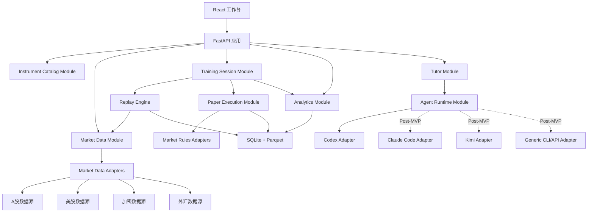
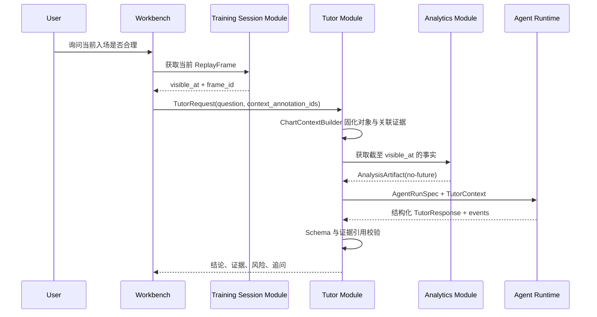

# ReplayTutor 系统架构

实施注记（2026-08-02）：前端新增 Indicator Catalog 与 Indicator Controller 深模块。
目录固定暴露 KLineChart 10.0.0 的 27 个内置指标及 VWAP、ATR、Bar Count、Order Block；
Controller 是页面与 KLineChart 指标接口之间唯一 seam，负责创建、覆盖和删除实例。
自有指标为纯内存确定性计算，只消费 ReplayFrame 已返回的可见 bars；Order Block 的
确认结果只从突破确认柱向后输出，追加未来 bars 不得改变既有前缀。当前配置仅为本地
显示状态。用户显式选择 MA、EMA、VOL、OBV、VWAP、ATR、Bar Count 或 Order Block
后，Tutor Runtime 按 `frame_id + timeframe` 重新取得服务端裁剪 bars，由 Indicator
Module 使用 Decimal 生成版本化 IndicatorEvidence；只有来源 bar ID 进入证据白名单。

实施注记（2026-08-02）：绘图对象 V2 使用 Alembic `0017_chart_objects_v2`，在保留
`shape + points + metadata` 兼容读取的同时增加 `tool_version + geometry + style +
properties + derived_facts + algorithm_version`。对象修改仍写入追加式事件；模板和工具
偏好分别进入 `chart_tool_template`、`chart_tool_preference`。前后端注册表都必须精确
包含 40 个用户工具，`ai_suggestion` 只属于独立 AI 图层。

> Public English entry point: [ARCHITECTURE.md](ARCHITECTURE.md). Locale affects presentation only; identifiers, timestamps, replay boundaries, deterministic calculations, and evidence membership remain language independent.

实施注记（2026-08-02）：工作台 Chart Tool Registry 增加前端多头/空头仓位计划模式。
键盘操作统一经过 Workbench Shortcut Resolver；回放推进仍调用带 expected_revision 的
服务端命令，交易快捷键只写前端草稿状态，不能直接触发订单提交或突破 visible_at。
两种模式都持久化为既有 `risk_reward` 语义对象，并在 metadata 保存方向、入场价、
止损价、目标价和确定性 R:R；未引入会影响撮合或账本的新对象类型。绘图锚点可磁吸到
最近可见 K 线 OHLC，客户端拦截未来留白区，`AnnotationService` 继续以服务端
`visible_at` 作为最终安全边界。

实施注记（2026-08-02）：Alembic `0016_annotation_metadata_events` 为标注修订事件增加
`replacement_metadata_json`。`AnnotationDisposition` 同时解析有效标签、有效坐标和
有效 metadata；Chart Context Builder 只读取三者的同一有效版本。工作台因此可以在
拖动趋势线、通道、斐波那契、测量尺或仓位计划控制点后追加一致的修订事件，并用同一
事件模型实现删除、撤销和重做，不触碰确定性执行与账本模块。

实施注记（2026-07-31）：新增 `0014_chart_context`、语义化 Chart Tool Registry 和
`ChartContextBuilder`。客户端只提交选中标注 ID；Builder 在服务端解析有效处置状态、
裁剪 `visible_at`、关联可见 K 线，并把对象快照保存为不可变
`chart_context_bundle`。Tutor run 只引用 `context_bundle_id`，旧回答不会随图形修改漂移。

实施注记（2026-08-02）：Alembic `0015_dataset_download_jobs` 将 Binance 行情下载
迁入 SQLite 持久任务。FastAPI lifespan 恢复 queued/running 任务并在同进程 worker
执行；前端通过 TanStack Query 在 AppShell 全局轮询进度，路由切换不会取消任务。
成功后只发布不可变 Snapshot，不自动改变页面或创建训练会话。
Snapshot 的“不可变”指内容不可原地修改，不代表不能由用户管理。删除操作仅允许作用于
未被任何训练会话引用的 Snapshot，文件先移动到 `data/trash/market-snapshots`，再删除
SQLite 索引；被会话引用时返回冲突，不级联破坏历史事实。

实施注记（2026-08-02）：训练创建不再把“最新 Snapshot + 数据开头”作为不可见默认。
前端列出同品种、同市场的可用 Snapshot 版本，`CreateSessionSpec` 固定用户选择的
`snapshot_id`，并支持 `start_mode=specific` + `start_time`。服务端通过 DuckDB 在该
不可变 Parquet 内解析 bar index，校验预热窗口和未来 bar 后才签发首个 ReplayFrame；
客户端日期不能直接成为 `visible_at` 真源。

状态：Implemented through MVP 1A
更新时间：2026-07-31

实施注记（2026-07-31）：Alembic `0010_annotation_events` 为用户和 AI 标注增加
append-only 处置事件。`session_annotation` 继续保存不可变原始对象；接受、拒绝、
修改和删除只追加事件，由 `AnnotationService` 解析有效形状。AI 标注默认
`proposed`，用户接受后仍保持 `layer=ai` 与 `provenance_run_id`，不得伪装成用户
原始判断。

实施注记（2026-07-31）：`EvidenceResolver` 将计划、订单、成交、可见 K 线和
用户/AI 标注解析为只读 `EvidenceTarget`。复盘链接使用
`/sessions/{session_id}?mode=review&evidence={evidence_id}`；REVIEW 工作台禁止
推进回放或写入业务状态，只负责定位时间、价格和实体图层。

实施注记（2026-07-31）：Alembic `0011_playbook_rules` 为不可变 Playbook 版本
增加结构化规则定义和评估器版本。`PlaybookEvaluator` 只消费确定性会话、计划和
订单事实，输出 `passed/failed/unknown`、原因码和证据 ID；最终结果进入复盘哈希。
自由文本规则保持 `unknown`。Tutor 只能读取并原样转述这些检查，服务端会覆盖模型
自行生成的规则状态。

实施注记（2026-07-31）：训练聚合从每场不可变复盘中的
`dimension_observations` 重算五维能力。每维至少 5 个可解析会话才显示分数，
响应保留 passed/evaluated 原始计数与 session ID。训练推荐只使用最低确定性
维度和该维度失败最多的 Playbook，不读取盈亏排名。单场复盘同时保存最多 200 点
确定性净值曲线和可回跳操作时间线。

实施注记（2026-07-31）：Alembic `0012_local_hardening` 增加会话软删除和本地
偏好。会话回收只写 `deleted_at`，聚合与正常索引排除回收项，恢复不改变订单、
证据或复盘。设置页支持 local-only 偏好、SQLite 在线备份/完整性校验恢复和
Agent 运行目录的可恢复清理。应用启动会收敛遗留 running Tutor 状态，构建门禁
扫描本机路径、数据库、日志和 secret pattern。

实施注记（2026-07-30）：训练纵向闭环已实现到 Alembic
`0009_annotations`：服务端 `frame_id`/`visible_at`、命令幂等与恢复、下一根
激活的模拟撮合、Decimal 账本、确定性复盘、不可变 Playbook、用户/AI 图层，
以及 Codex-only Tutor Runtime。Codex 输出只能进入解释和 AI 标注层，不能修改
订单、成交、账本、行情或用户图层。

实施注记（2026-07-19）：M1 已按本文 seam 实现 `Instrument`、`DataSnapshot`、Parquet 原子提交、DuckDB 参数化查询、Binance/File/Golden 数据入口与 Alembic `0002_market_data`。数据中心可以浏览完整 Snapshot；M2 Replay 接口必须在此查询层之上增加由服务端 Session 解析的 `visible_at`，不得把数据中心的自由浏览接口直接复用于回放客户端。

实施注记（2026-07-27）：新增 Binance U 本位只读交易复盘切片与 Alembic `0003_trade_review`。`ExecutionFill → TradeEpisode → PriceActionAnnotation → ReviewArtifact` 全链路写入本地 SQLite/离线 HTML；1m 行情按 UTC 聚合为 5m/15m/1h/2h/4h。所有 `decision_time` 标注只能读取入场前已收盘 K 线，入场后数据只进入 `after_action` 管理审查。私有适配器只暴露签名 GET，不包含下单、撤单、转账或提现方法。

## 1. 架构目标

首版采用本地优先的单应用架构：一个前端、一个后端进程、一套元数据数据库和一个行情数据目录。内部保持明确模块与接口，以便未来替换数据源、图表实现、存储和 Agent，而不提前拆成微服务。

关键质量目标：

- **确定性**：相同数据快照、规则版本、撮合配置和回放种子产生相同结果。
- **无未来泄露**：任何回放中查询都强制受 `visible_at` 限制。
- **可审计**：行情、订单、成交、AI 输入/输出均有来源和版本。
- **可扩展**：新增市场或 Agent 只增加适配器，不改回放核心。
- **本地安全**：Coding Agent 在隔离工作目录中运行，不能接触券商密钥。

## 2. 推荐技术栈

| 层 | MVP 选择 | 原因 |
|---|---|---|
| 前端 | React + Vite + TypeScript | 适合高状态密度图表工作台 |
| 图表 | KLineChart | 内置指标/画线、移动端支持、Apache-2.0 |
| 状态 | Zustand + TanStack Query | 本地交互状态与服务端状态分离 |
| 后端 | Python 3.12 + FastAPI | 数据处理生态和 Agent 子进程编排成熟 |
| 元数据 | SQLite（WAL） | 本地单用户简单可靠 |
| 行情存储 | 分区 Parquet + DuckDB 查询 | 压缩好、适合多市场时间序列和批量分析 |
| 任务 | SQLite 持久任务表 + 后台 worker | MVP 无需 Redis |
| 数据模型 | Pydantic + JSON Schema | 后端、Agent 和审计产物共享结构 |
| 启动 | 宿主机启动器；后续桌面壳 | 原生 Agent CLI 与登录态必须留在宿主机 |

SQLite 保存账户、品种元数据、回放会话、订单、成交、日志和 Agent 运行；大体量 OHLCV/tick 数据保存为不可变 Parquet 分区。不要把全部分钟线塞进 SQLite。

MVP 不把 FastAPI 和 Agent Runtime 放进 Docker。开发环境提供一条宿主机启动命令，同时启动 API、前端和后台 worker。Docker 只作为可选的可复现开发环境，不能成为访问本机 Codex 登录态的前提。MVP 只实现 CodexAdapter；其他 Agent Adapter 属于 Post-MVP。

## 3. 总体结构



## 4. 深模块与接口

以下接口是调用者和测试共同跨越的 seam。实现可以复杂，但接口保持小而稳定。

### 4.1 Instrument Catalog Module

职责：统一符号、市场、交易所、币种、时区和交易规格，消除 `600519`、`SH.600519`、供应商内部代码等差异。

```python
resolve(query: InstrumentQuery) -> Instrument
map_vendor_symbol(instrument_id, vendor_id) -> VendorSymbol
```

核心 `Instrument` 字段：

```text
instrument_id, asset_class, market, venue, canonical_symbol,
base_currency, quote_currency, timezone, tick_size, lot_size,
price_scale, session_calendar_id, market_rule_set_id
```

### 4.2 Market Data Module

职责：拉取、标准化、校验、版本化和查询行情；调用者不感知供应商格式。

```python
ensure(request: DataRequest) -> DataSnapshot
query(snapshot_id, window: MarketWindow) -> MarketSlice
```

不提供无 `snapshot_id` 的回放查询。`MarketSlice` 必须返回质量标记：缺口、重复、异常值、复权状态和来源。

时点 L2 盘口由独立的 `MarketDepthService` 管理。数据可来自 Binance 公共 REST 深度快照或
带时间戳的文件导入，统一标准化为排序后的 bids/asks、累计数量与累计名义金额。会话查询始终
以 `snapshot_id` 和 `captured_at <= ReplayFrame.visible_at` 过滤；没有合格快照时返回结构化
`unavailable`，超过 60 秒返回 `stale`。REST 快照用于本地采集起点；连续实时订单簿若启用，
必须按供应商的 snapshot + diff sequence 规则校验，断号后丢弃本地簿并重新同步。

### 4.3 Training Session Module

职责：作为 HTTP route 和测试进入训练系统的唯一写入 seam，在一个事务中协调回放、撮合、账本和 revision。调用者不能分别推进 Replay Engine 和 Paper Execution。

```python
create_session(config: CreateSession) -> SessionView
execute(session_id, command: SessionCommand) -> SessionDelta
get_session(session_id) -> SessionView
finish_session(session_id, expected_revision) -> FinishedSession
```

模块负责 `command_id` 幂等、`expected_revision` 乐观锁和固定处理顺序。Replay Engine、Paper Execution、Ledger 是它的内部深模块，由各自接口测试，但不直接暴露给 route。

### 4.4 Replay Engine

职责：维护回放时钟和可见窗口，发布确定性市场事件。

```python
create(config: ReplayConfig) -> ReplaySession
advance(session_id, command: ReplayCommand) -> ReplayFrame
```

`ReplayFrame` 是前端与 Tutor 唯一可见的市场帧。模块内部强制：

```text
event.timestamp <= session.visible_at
```

调用者不能传任意结束时间绕过限制。

`frame_id` 是服务端签发的不可猜测引用，绑定 `session_id`、`snapshot_id`、`visible_at` 和帧序号。Paper Execution、Analytics 与 Tutor 收到 `frame_id` 后必须在服务端重新解析边界，禁止信任客户端提交的 `visible_at` 或任意分析窗口。

### 4.5 Paper Execution Module

职责：验证市场规则、管理订单状态、撮合成交和维护虚拟账本。

```python
submit(account_id, order: OrderIntent, frame_id) -> OrderResult
apply(frame: ReplayFrame) -> ExecutionBatch
```

订单状态：

```text
draft → accepted → working → partial → filled
                   ↘ canceled / rejected / expired
```

所有余额和持仓都从不可变账本事件派生，避免直接修改一个“当前余额”导致无法审计。

### 4.6 Analytics Module

职责：确定性计算指标和行为事实，不生成自然语言意见。

```python
analyze(scope: AnalysisScope) -> AnalysisArtifact
```

产物包含：P&L、费用、滑点、MFE/MAE、持仓时长、退出效率、规则命中、样本量和数据质量。计算版本写入产物。

### 4.7 Tutor Module

职责：构造时间安全上下文、调度 Agent、校验结构化响应、保存证据链。

```python
ask(request: TutorRequest) -> TutorRun
review(request: ReviewRequest) -> TutorRun
```

Tutor Module 不接受原始数据库连接，也不允许 Agent 自行查询全量行情。它只发放经过裁剪的 `TutorContext`。

### 4.8 Agent Runtime Module

职责：发现原生 Agent、启动/取消运行、流式接收事件、恢复会话和标准化结果。

```python
discover() -> list[AgentCapability]
run(spec: AgentRunSpec) -> AgentRunHandle
cancel(run_id) -> None
```

具体绑定见 [AGENT_BINDING.md](AGENT_BINDING.md)。

## 5. 回放与撮合设计

### 5.1 事件时间

系统区分：

- `event_time`：市场实际发生时间。
- `ingested_at`：数据进入系统时间。
- `visible_at`：当前回放允许看到的最晚时间。
- `decision_at`：用户提交决策时间。
- `activated_at`：订单最早允许参与撮合的市场时间。

AI 上下文和图表都使用同一个 `visible_at`，禁止各自维护游标。

训练撮合以不可变 1m Snapshot 和服务端 ReplayFrame 为真源。工作台可请求
`1m / 5m / 15m / 1h / 4h / 1d` 只读图表窗口；高周期由服务端只聚合
`close_time <= visible_at` 的 1m bars，切换不推进 revision，也不改变撮合结果。
多图布局由前端同时订阅这些只读窗口。各窗格只有独立 timeframe 与 viewport，必须共享
同一个 session、frame、品种、订单、成交和图层状态；活动窗格只决定键盘与绘图操作的
UI 目标，不能成为第二个回放游标。

MVP 采用“完整 K 线决策”语义：一根 K 线在收盘后才成为完整可见信息。用户基于该 K 线提交的订单设置 `activated_at = next_bar.open_time`，不得使用刚刚看见的当前柱高低价撮合。若未来支持逐 tick 或形成中 K 线，必须引入独立 frame 类型，不能复用完整 K 线语义。

### 5.2 K 线级撮合的歧义

仅有 OHLC 时，无法知道同一根 K 线内先到最高价还是最低价。因此 MVP 必须提供并记录撮合策略：

- `next_bar_open`：市价单在下一根开盘成交，最保守、易解释。
- `touch_conservative`：限价/止损触达成交；同根同时触发止盈止损时按不利路径处理。
- `lower_timeframe`：若有更低周期数据，下钻判断先后顺序。

禁止默认选择对用户最有利的路径。后续 tick 回放增加真实序列撮合。

所有金额、价格、数量、费用和汇率使用 Decimal 或整数最小单位计算，不使用二进制浮点作为账本真源。每种市场规则明确价格精度、数量精度、币种精度和舍入方向。

### 5.3 市场规则适配器

```python
validate_order(context, intent) -> ValidationResult
normalize_order(context, intent) -> NormalizedOrder
fees(execution) -> FeeBreakdown
settlement(execution) -> SettlementEvents
```

至少提供：`CNEquityRules`、`USEquityRules`、`CryptoSpotRules`、`FXSpotRules`。合约、期权和杠杆产品后续单独增加规则，不塞进现货规则分支。

## 6. 数据模型

### 6.1 SQLite 核心表

| 表 | 用途 |
|---|---|
| `instrument` | 统一品种目录 |
| `vendor_symbol` | 数据商符号映射 |
| `market_calendar` | 交易日历版本 |
| `data_snapshot` | 行情快照与来源版本 |
| `dataset_download_job` | 行情后台下载状态、进度、错误与 Snapshot 产物 |
| `market_depth_snapshot` | 与数据快照绑定的时点 L2 买卖盘、来源和更新序列 |
| `replay_session` | 回放配置、游标、种子、状态 |
| `replay_event` | 用户与系统事件时间线 |
| `paper_account` | 虚拟账户配置 |
| `order_intent` | 用户原始订单意图 |
| `order_event` | 订单状态事件 |
| `execution` | 成交事实 |
| `ledger_entry` | 现金、持仓、费用账本 |
| `trade_import` | 真实成交导入批次 |
| `playbook` | 策略规则和检查表 |
| `analysis_artifact` | 确定性分析产物 |
| `tutor_thread` | Tutor 会话 |
| `agent_run` | Agent 运行、状态和成本/耗时 |
| `agent_artifact` | 输入、输出、报告和证据映射 |

### 6.2 行情目录

```text
data/market/
  market=CN/asset=equity/timeframe=1m/year=2026/month=07/*.parquet
  market=US/asset=equity/timeframe=1m/year=2026/month=07/*.parquet
  market=CRYPTO/venue=binance/timeframe=1m/year=2026/month=07/*.parquet
  market=FX/venue=oanda/timeframe=1m/year=2026/month=07/*.parquet
```

每个 Parquet 文件必须带 schema 版本、供应商、获取时间、时区、复权与校验摘要；内容写入后不可原地覆盖，通过新快照替代。

行情同时保留两套价格语义：

- `raw_*`：交易所原始可交易价格，用于撮合、涨跌停、费用和账本。
- `adjusted_*`：带复权因子的展示/分析价格，只用于图表连续性和明确标注的统计。

拆股、分红、送转和复权因子作为版本化 corporate action 事件保存。禁止直接使用前复权价格撮合订单。

`data_snapshot` 保存 manifest 与内容 hash，至少冻结供应商版本、文件 hash、交易日历版本、corporate action 版本和数据质量摘要。

## 7. Tutor 数据流



事后复盘使用独立 `ReviewRequest`，上下文明确标记 `perspective=after_action`，并允许完整行情与最终结果。

## 8. 任务与状态

耗时操作进入持久任务表：行情下载、数据校验、真实成交导入、Agent 运行、批量周期复盘。

```text
queued → running → succeeded
              ↘ retrying → failed
              ↘ canceled
```

任务保存心跳、进度、错误类型、可重试性和产物 ID。应用重启后可以恢复或明确失败，不能永远显示“处理中”。

## 9. 安全与隐私

- MVP 不连接真实交易权限；数据适配器只读。
- 券商密钥只能进入系统凭据存储，不写日志、不进入 TutorContext。
- Agent 运行目录只含经过裁剪的 JSON/Markdown 证据包。
- 子进程使用参数数组启动，不把用户输入拼成 shell 命令。
- Agent 默认 `prompt_only`；需要读证据文件时仅开放运行目录内只读工具，不开放写入和任意工具网络。无法限制到运行目录的 `host_read_only` Adapter 默认禁用。
- 每次 Agent 运行记录命令模板版本，但对 token、路径中的 secret 做脱敏。
- 用户可以查看并删除线程、Agent 产物和原始导入文件。

## 10. 可观测性与审计

统一关联 ID：

```text
request_id → replay_session_id → frame_id → analysis_artifact_id
           → tutor_thread_id → agent_run_id → agent_artifact_id
```

核心指标：

- 行情覆盖率、缺口率、最后同步时间。
- 回放帧延迟、查询耗时、撮合耗时。
- Agent 首 token、总耗时、退出状态、结构化输出通过率。
- Tutor 证据引用通过率、未来数据泄露拦截次数。

原始 prompt 可以选择不长期保存；默认保存 prompt 模板版本、上下文摘要 hash 和结构化结果，以兼顾隐私与可复现性。

确定性重放指交易与分析事实可重建，不承诺云端 LLM 逐字输出一致。需要审计 AI 结果时保存当次结构化输入、模型/Agent 标识、模板版本和原始结构化输出；只保存 hash 的会话不能声称可重现 AI 文本。

## 11. 测试策略

### 11.1 必须通过的属性测试

- 相同输入重放结果一致。
- 任意返回行情的时间不晚于 `visible_at`。
- 账本借贷平衡，现金和持仓可从事件完全重建。
- 市场规则在边界时刻正确：休市、T+1、lot size、tick size、涨跌停。
- 同一 K 线止损/止盈同时触发时遵循配置的保守策略。
- 完整 K 线可见后提交的订单无法在该 K 线内成交。
- 客户端伪造 `visible_at`、窗口结束时间或跨会话 `frame_id` 均被拒绝。
- raw/adjusted 价格双轨不会改变原始成交和账本结果。

### 11.2 适配器契约测试

所有数据源适配器使用同一份测试套件，验证符号映射、时区、分页、去重、缺口和限流。所有 Agent 适配器验证发现、运行、流式事件、取消、超时、结构化响应和错误分类。

### 11.3 Golden Session

维护少量固定回放数据集：A 股 T+1、涨停无法成交、美股拆股、加密 7×24、外汇周末休市。每次改动回放/撮合模块都重放并比较完整事件流。

## 12. 部署演进

### 本地 MVP

```text
浏览器 → FastAPI(:8788) → SQLite + local Parquet + local agent CLIs
```

以上进程默认直接运行在宿主机。启动器只传递环境白名单，不读取或复制 Agent token；Agent CLI 使用各自已有的本机认证机制。

M0 本地入口已经固定为 `make setup` 与 `make dev`：Vite 仅监听 `127.0.0.1:5173`，FastAPI 仅监听 `127.0.0.1:8788`，SQLite 位于 gitignored 的 `data/app.db` 并由 Alembic 管理。开发期不启动 Docker、Redis、Celery 或外部数据库。

### 多设备/云端（后续）

元数据迁移到 PostgreSQL，Parquet 迁移到对象存储，任务 worker 可独立扩展。模块接口保持不变。原生 CLI Agent 仍运行在用户本地 companion 上，通过一次性授权与云端会话连接，避免把本机登录凭据上传服务器。

## 13. 建议仓库结构

```text
replaytutor/
  apps/
    web/                    # React/Vite
    api/
      replaytutor/          # FastAPI 入口与后端模块
        api/
        contracts/
        modules/
        adapters/
        storage/
        jobs/
  packages/
    contracts/              # JSON Schema / generated TS types
  data/                     # gitignored runtime data
  tests/
    contracts/
    golden_sessions/
  docs/
```

## 14. 架构决策记录

| 决策 | 选择 | 暂不选择 |
|---|---|---|
| 部署 | 宿主机单应用、本地优先 | 首期 Docker 强绑定、微服务/Kubernetes |
| 元数据 | SQLite | 首期 PostgreSQL |
| 行情 | Parquet + DuckDB | 全塞 SQLite、首期专用时序数据库 |
| 图表 | KLineChart | TradingView 非开源 Advanced Charts |
| 回放 | 事件驱动、快照版本化 | 仅前端数组切片 |
| AI | 确定性分析 + Agent 解释 | 让 LLM 自己计算盈亏 |
| Agent | 原生 CLI + 通用适配器 | 只绑定一个模型 API |
| 权限 | 默认只读、证据包隔离 | 继承 Agent 全部本机权限 |
| 决策时点 | 完整 K 线后决策，下一根激活 | 当前柱回填成交 |
| 价格语义 | raw 撮合 + adjusted 展示双轨 | 使用复权价撮合 |

## 15. 合约账户与订单执行

执行接口支持现货与 USDT 本位永续账户。订单、保证金、资金费率和强平
语义以 `DERIVATIVES_EXECUTION.md` 为准；数据与市场规则适配器可以提供
输入，但 AI 模块始终只是账本结果的只读消费者。
