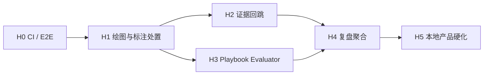

# ReplayTutor MVP 1A 封板实施计划

状态：Implemented and requirement-audited in stacked PRs #1–#6
日期：2026-07-31  
基线提交：`c087e3c`  
目标：把当前可运行的 MVP 1A 核心纵向闭环推进为可持续使用、可自动验收的本地产品。

完成证据：H0–H5 已分别落到 `codex/e2e-ci`、`codex/annotation-workflow`、
`codex/evidence-jump`、`codex/playbook-evaluator`、`codex/review-aggregation`
和 `codex/local-hardening`。最终需求审计门禁为 49 个后端测试、8 个前端测试、
8 个隔离浏览器 E2E、三宽度/axe 验收、API/Web kill-restart 恢复、
成功验收截图/trace/摘要与构建/Git 产物扫描。

上游真源：

- [视觉与交互设计系统](../../DESIGN.md)
- [产品与交互设计](../DESIGN.md)
- [系统架构](../SYSTEM_ARCHITECTURE.md)
- [Agent 绑定规范](../AGENT_BINDING.md)
- [MVP 实施计划](../MVP_IMPLEMENTATION_PLAN.md)
- [产品化实施计划 v2](2026-07-30-replaytutor-implementation-plan-v2.md)

## 1. 实施结论

近期不扩展 A 股、美股、外汇、云同步或其他 Agent。先封住一条可由自动化证明的用户闭环：

```text
载入 Golden Dataset
  → 创建未知日期训练
  → 用户画结构与关键位
  → 锁定计划
  → 提交并管理模拟订单
  → 逐 K 回放
  → AI 提交独立图层建议
  → 用户接受、拒绝或修改
  → 结束会话
  → 查看确定性复盘
  → 点击证据回到对应 K 线、价格与图层
  → Playbook 逐条显示 passed / failed / unknown
```

封板顺序：

1. 先建立 CI 和真实应用 E2E，避免后续修改破坏反前视与账本。
2. 再完成用户绘图和 AI 标注处置，形成“用户先画、AI 再回应”。
3. 然后实现证据回跳与确定性 Playbook 检查。
4. 最后补齐复盘聚合和发布前产品硬化。

## 2. 当前基线

### 2.1 已有能力，直接复用

| 能力 | 当前入口 | 本计划中的用途 |
|---|---|---|
| 统一质量门 | `Makefile` 的 `make verify` | 每个 PR 的必过门禁 |
| Golden Dataset | `tests/fixtures/market/` | E2E 的唯一固定行情输入 |
| Session/Replay | `modules/training_session`、`modules/replay` | 继续作为唯一状态与时间边界 |
| Paper Execution/Ledger | `modules/execution`、`modules/ledger` | 不改变确定性真源 |
| 标注持久化 | `modules/annotations/service.py` | 扩展为可审计的标注事件 |
| 图表渲染 | `apps/web/src/chart/ReplayChart.tsx` | 增加绘图适配器与选择桥 |
| 复盘证据 | `EvidenceRef(frame_id, occurred_at, price)` | 建立 evidence resolver 和回跳 |
| Playbook 版本 | `modules/playbook/service.py` | 增加结构化规则定义与评估器 |
| Tutor 校验 | `modules/tutor/validation.py` | 保持 evidence 白名单和图形边界 |
| 离线报告浏览器测试 | `tests/browser/test_trade_review_report.py` | 去除本机 Chrome 硬编码并纳入 E2E |

### 2.2 当前关键缺口

- `make e2e` 不存在，Playwright 未进入锁定依赖。
- 浏览器测试只覆盖 Binance 离线报告，未覆盖 ReplayTutor 主应用。
- 趋势线和矩形按钮仍禁用，用户只能标记当前价格。
- AI 标注自动写入图层，没有接受、拒绝、修改状态。
- 复盘 evidence 只是静态列表，不能回到图表。
- Playbook 规则为自由文本，没有确定性 evaluator。
- 设置、会话回收、能力评分和恢复矩阵尚未封板。

## 3. 不可违反的实现约束

1. UI、绘图、Tutor 和复盘继续使用服务端签发的 `frame_id`/`visible_at`。
2. 标注点不能引用 `visible_at` 之后的时间；客户端坐标不能绕过服务端校验。
3. 撮合、账本、MFE/MAE、P&L 和 Playbook 确定性检查不交给 AI。
4. AI 只能创建 AI 图层提案；不能修改用户原始标注、订单、成交或账本。
5. 编辑和删除采用 append-only 事件，不原地覆盖审计证据。
6. E2E 使用独立临时数据目录，不读取或污染用户的 `data/app.db`。
7. CI 不读取 Binance、Codex 或其他本机凭据。
8. 回放中不得通过缩放、证据、轴范围或派生周期泄露未来数据。

## 4. 目标架构增量

```text
React Workbench
  ├── DrawingController ───────┐
  ├── AnnotationInspector      │
  ├── EvidenceSelectionBridge  │
  └── TutorDock                │
                               ▼
FastAPI Session Routes
  ├── AnnotationService
  │     ├── session_annotation          原始不可变对象
  │     └── session_annotation_event    接受/拒绝/修改/删除事件
  ├── EvidenceResolver
  │     └── EvidenceTarget(frame/time/price/layer/entity)
  ├── PlaybookEvaluator
  │     └── RuleCheck(passed/failed/unknown + evidence)
  └── TrainingSessionService            唯一写入协调边界

Test Harness
  ├── temporary REPLAYTUTOR_DATA_DIR
  ├── Golden Dataset bootstrap
  ├── Fake Tutor Adapter
  ├── FastAPI + Vite process supervision
  └── Playwright browser flows
```

不新建微服务，不引入 Redis，不把图表状态放进全局数据库，不让 route 分别编排回放、撮合和账本。

## 5. 数据与契约设计

### 5.1 标注处置事件

保留现有 `session_annotation` 作为不可变原始标注，新增迁移
`0010_annotation_events`：

```text
session_annotation_event
  event_id
  annotation_id
  session_id
  expected_revision
  action              accepted | rejected | revised | deleted
  replacement_label   nullable
  replacement_points_json nullable
  command_id          unique
  actor               user
  created_at
```

解析规则：

- 没有事件：用户标注为 `active`，AI 标注为 `proposed`。
- `accepted`：AI 标注进入用户确认态，但仍保留 `layer=ai` 和 provenance。
- `rejected`：默认不渲染，Inspector 可显示历史。
- `revised`：渲染 replacement payload，原始内容保持可审计。
- `deleted`：不渲染，但保留原始对象和事件链。
- 每个新事件必须幂等，并验证 session、revision、frame 和 visible boundary。

新增契约：

```text
AnnotationDisposition
  annotation_id
  state              active | proposed | accepted | rejected | deleted
  effective_label
  effective_points
  original_annotation
  latest_event_id

AnnotationActionRequest
  command_id
  expected_revision
  action
  label?
  points?
```

新增 API：

```text
POST /api/v1/sessions/{session_id}/annotations/{annotation_id}/actions
```

不提供直接 `UPDATE session_annotation`。

### 5.2 EvidenceTarget

新增只读契约：

```text
EvidenceTarget
  evidence_id
  session_id
  kind
  frame_id
  occurred_at
  price?
  layer?
  annotation_id?
  order_id?
  fill_id?
```

新增 API：

```text
GET /api/v1/sessions/{session_id}/evidence/{evidence_id}
```

resolver 只解析该 session 已公开的计划、订单、成交、标注和 bar。跨会话 ID、未知 ID 或未完成会话的事后证据返回明确错误。

### 5.3 结构化 Playbook 规则

自由文本不能被伪装成确定性规则。扩展 Playbook 契约：

```text
PlaybookRuleDefinition
  rule_id
  label
  evaluator_kind
  params

PlaybookRuleCheck
  rule_id
  status              passed | failed | unknown
  reason_code
  summary
  evidence_ids
```

首批 evaluator 只覆盖当前系统可证明的规则：

- `plan_locked_before_first_order`
- `order_activated_on_next_bar`
- `risk_amount_within_limit`
- `protective_stop_present`
- `no_order_after_session_complete`
- `entry_side_matches_locked_plan`

官方 Playbook 使用结构化定义。用户自定义自由文本规则在没有 evaluator 映射时必须返回 `unknown`，不能让 Tutor 猜测通过或失败。

评估结果写入确定性 review payload/hash；Tutor 只能解释这些结果。

## 6. 开发波次

## H0：CI 与 E2E 安全网

目标：任何后续 PR 都能自动证明核心工程门和主用户闭环没有退化。

任务：

| ID | 工作 | 主要文件 |
|---|---|---|
| H0-01 | 将 Python Playwright 加入 dev lock | `apps/api/pyproject.toml`、`apps/api/uv.lock` |
| H0-02 | 去掉离线报告测试的 macOS Chrome 硬编码 | `tests/browser/test_trade_review_report.py` |
| H0-03 | 建立临时数据目录和 API/Web 进程监督 fixture | `tests/e2e/conftest.py` |
| H0-04 | 实现 Golden Dataset → Session → Replay 主流程 | `tests/e2e/test_training_flow.py` |
| H0-05 | 实现 Agent 不可用和 Fake Tutor 两条降级路径 | `tests/e2e/test_tutor_flow.py` |
| H0-06 | 增加 `make e2e`，保证退出时清理子进程 | `Makefile` |
| H0-07 | 增加 GitHub Actions verify/e2e 工作流 | `.github/workflows/ci.yml` |
| H0-08 | README 写明本地浏览器安装和故障恢复 | `README.md` |

E2E 场景：

1. 空临时目录启动后健康检查为当前 migration。
2. 载入 44,640 根固定 Golden Dataset。
3. 创建隐藏日期会话，只看得到当前 frame 及之前 bars。
4. 锁计划后提交市价/限价/bracket，订单只在下一根激活。
5. 刷新页面后 revision、订单、持仓和图层恢复。
6. 结束会话后才能看到确定性复盘。
7. Agent 不可用时回放、下单和复盘继续可用。
8. Fake Tutor 返回合法标注时只写 AI 图层。
9. 浏览器 console/page error 为零。

退出条件：

- `make verify && make e2e` 全绿。
- CI 从全新环境安装依赖并通过。
- E2E 不访问用户数据库、Binance 凭据或真实 Codex。
- 失败时输出服务日志、截图和 trace，而不是只报超时。

## H1：完整用户绘图与标注处置

目标：用户能先画图，AI 再提交建议，双方图层可比较且全程可审计。

任务：

| ID | 工作 | 主要文件 |
|---|---|---|
| H1-01 | 新增 annotation event 迁移与契约 | migration、`contracts.py` |
| H1-02 | 扩展 AnnotationService 的 action/resolve 接口 | `modules/annotations/service.py` |
| H1-03 | 新增 action route 与前端 API | session routes、`api/sessions.ts` |
| H1-04 | 抽出 DrawingController 与 KLineChart overlay adapter | `chart/` |
| H1-05 | 开放趋势线、矩形、标记、选择、修改和删除 | `WorkbenchPage.tsx` |
| H1-06 | 新增 AnnotationInspector | `components/` |
| H1-07 | AI 标注接受、拒绝、修改、追问 | `TutorDock.tsx` |
| H1-08 | 单元、契约和 E2E 覆盖 | backend/web/e2e tests |

交互规则：

- 选择绘图工具后，未完成对象只存在前端草稿中。
- 用户确认后才发送服务端命令。
- `Esc` 取消草稿，不产生事件。
- 编辑和删除产生 append-only event。
- AI 标注默认 `proposed`，不自动变成用户判断。
- 修改 AI 标注产生用户处置事件，不能覆盖 AI 原始输出。
- rejected/deleted 默认隐藏，可从 Inspector 恢复查看历史。

退出条件：

- 用户可以完成趋势线、矩形、标记的创建、选择、修改、删除。
- 所有动作刷新后恢复一致。
- 未来点、跨会话 annotation、旧 revision 和重复 command 均有测试。
- AI 原始标注、用户处置和最终有效形状可以分别审计。

## H2：证据回跳

目标：复盘中的每条事实证据都能定位到图表，而不是停留在 ID 列表。

任务：

| ID | 工作 | 主要文件 |
|---|---|---|
| H2-01 | 新增 EvidenceTarget 契约与 resolver | contracts、evidence review module |
| H2-02 | 新增只读 evidence API | session routes |
| H2-03 | 实现 EvidenceSelectionBridge | `apps/web/src/chart/` |
| H2-04 | 复盘 evidence 行变成可访问操作 | `SessionReviewPage.tsx` |
| H2-05 | 完成会话只读 Workbench 模式 | `WorkbenchPage.tsx` |
| H2-06 | 图表定位、viewport、价格线和实体高亮 | `ReplayChart.tsx` |
| H2-07 | 键盘、返回焦点和深链接恢复 | web/e2e tests |

URL 约定：

```text
/sessions/{session_id}?mode=review&evidence={evidence_id}
```

用户结果：

- 点击证据后进入只读图表。
- 图表定位到对应时间并显示价格。
- 对应订单、成交或标注高亮。
- 浏览器刷新后仍保持同一 evidence 深链接。
- 返回复盘后焦点回到原证据行。

退出条件：

- 计划、订单、成交、用户标注、AI 标注五类证据全部可回跳。
- 未知、跨会话和无坐标 evidence 有明确空状态。
- 跳转不推进 session、不改变 revision、不解锁未来数据。

## H3：Playbook 确定性规则检查

目标：策略检查表由确定性数据驱动，AI 只解释，不负责判定。

任务：

| ID | 工作 | 主要文件 |
|---|---|---|
| H3-01 | 扩展 PlaybookRuleDefinition/Check 契约 | `contracts.py` |
| H3-02 | 为官方策略补稳定 rule ID 和 evaluator kind | playbook service |
| H3-03 | 实现 evaluator registry | `modules/playbook/evaluator.py` |
| H3-04 | 将 rule checks 纳入 TrainingReview/hash | evidence review service |
| H3-05 | Workbench 显示当下可判断检查表 | Tutor/Playbook dock |
| H3-06 | Review 显示最终 passed/failed/unknown 与证据 | review pages |
| H3-07 | TutorContext 只消费确定性检查结果 | tutor context |
| H3-08 | evaluator 契约、future-bait 与 E2E | tests |

退出条件：

- 同一 session/review 输入产生相同 rule checks 和 hash。
- 每个 passed/failed 都有合法 evidence ID。
- 数据不足和自由文本规则必须为 unknown。
- Tutor 输出不能覆盖确定性 status。
- 历史 session 继续绑定原 Playbook 版本和 evaluator 版本。

## H4：复盘聚合与训练推荐

目标：在样本足够时给出可信的能力反馈，不用默认值冒充分数。

任务：

| ID | 工作 |
|---|---|
| H4-01 | 保存五维确定性评分所需的原始计数 |
| H4-02 | 每维至少 5 个可解析会话才生成分数 |
| H4-03 | 增加净值曲线、操作时间线和样本说明 |
| H4-04 | 首页展示最近弱项和一条推荐训练 |
| H4-05 | 推荐只基于确定性维度与 Playbook，不使用盈利排名 |
| H4-06 | 补充低样本、混合 Playbook、删除会话后的重算测试 |

退出条件：

- 低样本继续显示“不足”。
- 分数可回溯到 session 和 rule checks。
- 盈利但坏过程不能提高纪律维度。
- 推荐训练明确显示样本数和生成原因。

## H5：本地产品硬化

目标：达到可交给真实用户连续试用的本地版本。

任务：

- 会话软删除、回收和恢复。
- 设置页增加训练偏好、AI 模式、隐私和数据清理。
- 1180/1440/1920 布局验收。
- 键盘导航、图表替代数据表和 axe。
- API/Web 崩溃恢复、迁移回滚演练、数据库备份恢复。
- Agent 超时、取消、崩溃和孤儿进程清理。
- 日志脱敏、构建包扫描和已知限制文档。

退出条件：

- 全套 `make verify && make e2e` 通过。
- 数据清理和会话删除为可恢复操作。
- 构建产物不包含本机路径、secret、数据库或运行日志。
- 发布验收清单有浏览器截图、trace 和测试摘要。

## 7. 测试矩阵

| 风险 | 单元/属性测试 | API 契约 | 浏览器 E2E |
|---|---|---|---|
| 未来数据泄露 | future-bait | 伪造 frame/visible_at 拒绝 | 图表未来区为空 |
| 标注越界 | point time 属性测试 | 旧 revision/跨 session | 绘图刷新恢复 |
| AI 污染用户图层 | layer/provenance | action actor 校验 | 接受/拒绝/修改 |
| evidence 错位 | resolver 映射 | unknown/cross-session | 深链接定位与高亮 |
| Playbook 误判 | evaluator fixtures | unknown 保留 | 检查表证据跳转 |
| 撮合退化 | 现有 execution tests | session command | 下一根激活 |
| 账本退化 | balance/rebuild | finish review | 账户刷新一致 |
| 进程泄漏 | supervisor tests | 健康检查 | CI 退出后无子进程 |

测试数据纪律：

- 确定性测试只使用仓库 Golden fixture。
- E2E 使用临时 SQLite/Parquet 目录。
- CI Tutor 使用 Fake Adapter。
- 真实 Codex 只做本地可选 smoke，不进入必过 CI。
- Binance 私有同步不进入 CI。

## 8. PR 与提交策略

每个波次独立分支和 PR，避免再次积累一个 183 文件的大提交：

```text
codex/e2e-ci
codex/chart-annotations
codex/evidence-navigation
codex/playbook-evaluator
codex/review-aggregation
codex/local-hardening
```

每个 PR 必须：

1. 同步契约生成产物和 migration 断言。
2. 更新对应设计/架构/Agent 文档。
3. 运行 `make verify`。
4. H0 完成后额外运行 `make e2e`。
5. 提供风险、验证证据和明确未覆盖项。
6. 不混入下一波次功能。

## 9. 依赖与关键路径



关键路径：`H0 → H1 → H2/H3 → H4 → H5`。

H2 与 H3 可以在 H1 契约稳定后并行，但在同一工作区实施时仍建议顺序合并，减少契约与生成文件冲突。

## 10. 风险与救援

| 风险 | 早期信号 | 救援策略 |
|---|---|---|
| KLineChart overlay 编辑能力不足 | 拖动坐标不能稳定回写 | 保持 Chart Adapter，使用受控 SVG overlay，不替换整个图表内核 |
| Playwright CI 偶发失败 | 等待 timeout、端口残留 | 使用随机端口、健康探针、trace、显式进程组清理 |
| 标注事件模型过度复杂 | UI 需要合并多种临时状态 | 服务端提供解析后的 AnnotationDisposition，前端不自行折叠事件 |
| evidence 深链接加载大量 bars | 完成会话首屏变慢 | resolver 返回目标窗口，图表按时间窗口加载，不一次返回全月数据 |
| 自由文本规则被错误自动判断 | evaluator 找不到映射 | 强制 unknown；只有注册 evaluator 能产生 passed/failed |
| AI 处置状态污染事实 | accepted 被当作确定性结论 | accepted 只代表用户采纳，仍显示 AI provenance |
| CI 依赖真实 Codex/Binance | 无凭据时失败 | Fake Adapter + Golden fixture，真实集成保持可选 smoke |

## 11. 明确不在近期范围

- A 股市场规则、交易日历、T+1、涨跌停和费用。
- 美股、外汇、期货、合约和杠杆。
- Claude、Kimi 或其他 Agent。
- 真实下单、跟单、自动交易或资金权限。
- 云同步、团队协作、社区和移动端完整交易。
- Pine Script、任意策略脚本和自动回测。
- tick/L2、多图联动和组合账户。

这些内容只有在 H0–H5 完成、真实用户试用反馈稳定后再进入新计划。

## 12. 完成定义

MVP 1A 封板必须同时满足：

- [x] `make verify` 与 `make e2e` 全绿。
- [ ] GitHub CI 在全新环境通过（等待本次需求审计提交的 CI）。
- [x] 用户能完成趋势线、矩形和标记的创建、修改与删除。
- [x] AI 标注可以接受、拒绝和修改，且原始 provenance 不丢失。
- [x] 五类 evidence 可以回跳到只读图表。
- [x] Playbook 规则检查由确定性 evaluator 生成。
- [x] 低样本能力维度不生成伪分数。
- [x] 会话、订单、账本、标注和 review 在刷新/重启后一致。
- [x] 回放与 Tutor future-bait 测试保持零泄露。
- [x] Agent 失败不影响回放、模拟交易和确定性复盘。
- [x] 数据库、凭据、日志和本机路径不进入构建或 Git。

最终审计补充证明：

- E2E 同时覆盖市价、未触达限价和 bracket 子单的激活边界。
- 趋势线、矩形、标记分别完成创建、选择、修改、删除和刷新恢复。
- 三次 Fake Tutor 运行分别覆盖接受、拒绝、用户修订，并校验原始 AI
  label、layer 和 `provenance_run_id` 保持不变。
- 计划、订单、成交、用户标注、AI 标注逐类进入只读 Workbench，并验证
  深链接、图表 evidence 高亮和缺价格坐标提示。
- Agent 不可用、超时、崩溃、取消和应用重启孤儿 run 均有终态与降级证明；
  取消测试确认已注册子进程退出。
- API/Web kill-restart 后 revision、execution、平衡 ledger、annotations 与
  review hash 不变。
- 成功 E2E 生成浏览器截图、Playwright trace 和机器可读测试摘要，CI 始终
  上传 `release-acceptance-artifacts`。

## 13. 首个执行任务

从 `H0-01` 到 `H0-08` 开始，使用分支：

```text
codex/e2e-ci
```

首个 PR 只交付 CI/E2E 安全网，不同时实现绘图。这样 H1 之后的图表、契约和迁移修改都有真实浏览器回归保护。
